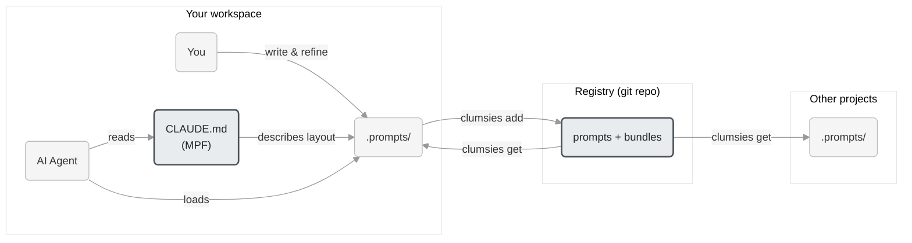

# clumsies

[](https://github.com/lilhammerfun/clumsies/actions/workflows/ci.yml)

User-level memory layer for AI agents.

## The problem

AI coding agents all have memory systems — Claude Code writes to `~/.claude/memory/`, Windsurf stores memories per workspace, Copilot keeps them server-side, Gemini CLI appends to `GEMINI.md`. You can view them, and some tools let you manually add entries.

But unless you actively check and intervene, memory is agent-managed by default. The agent decides what to remember and what to surface. A concrete example: when a conversation exceeds the context window, every major agent compresses or summarizes automatically — Claude Code at ~80% capacity, Cline at ~80%, Amazon Q at ~80%. You can influence the process (Claude Code accepts "Compact Instructions"), but you cannot decide precisely what gets kept and what gets forgotten.

Having a separate, user-level memory layer — one you write, organize, and maintain yourself — ensures the context that matters to you is always there, regardless of what the agent's built-in system does with its own memory.

The second problem is portability. Every tool's memory is project-scoped. At best you get a single global config file. There's no mechanism to selectively reuse pieces across projects.

This matters in practice: you refine prompts through real work — a commit format that catches edge cases, a code review checklist tuned to your team's patterns, testing rules that reflect lessons learned. Over time these become a personal prompt library tied to your role and workflow. But without a way to manage and distribute them, each prompt stays trapped in the project where it was written.

## What clumsies does

Two things, both simple:

**A user-level memory layer.** You write prompts as markdown files in `.prompts/`, organized however you want. A meta-prompt file, or MPF (CLAUDE.md, AGENTS.md, etc.), tells the agent where things are. This sits alongside the agent's built-in memory, not replacing it — giving you a layer you fully control.

**Cross-project portability.** A central registry (a git repo) lets you register prompts, refine them over time, and import them into any project. Your prompt library grows with your practice — update once, pull everywhere.

```
workspace/
├── CLAUDE.md              # MPF — tells the agent where things are
└── .prompts/
    ├── regulation/        # Reusable rules (from registry)
    ├── house-rules/       # Project-specific rules
    ├── command/           # Procedures (invoke by name)
    ├── context/           # Project knowledge (stays local)
    └── ...                # Whatever else you need
```

The MPF (CLAUDE.md, AGENTS.md, COPILOT.md — whatever your tool reads) describes the `.prompts/` layout in natural language. No special syntax, no tool integration. The agent reads the file, understands the structure, and knows where to find what it needs.

### How it fits together



Prompts get better through real use. You tell the agent "fix this code following regulation/coding/ZIG_STYLE", review the output, and find the prompt wasn't specific enough — so you refine it and try again. This cycle repeats until the prompt reliably produces the result you want. Once it's good enough, register it to the registry and reuse it across projects.

More on the design in [ARCHITECTURE.md](./ARCHITECTURE.md).

## Install

```bash
curl -fsSL https://raw.githubusercontent.com/lilhammerfun/clumsies/main/install.sh | sh
```

<details>
<summary>Manual install</summary>

```bash
# Download binary and checksums
curl -LO https://github.com/lilhammerfun/clumsies/releases/latest/download/clumsies-darwin-arm64
curl -LO https://github.com/lilhammerfun/clumsies/releases/latest/download/checksums.txt

# Verify and install
shasum -a 256 -c checksums.txt --ignore-missing
chmod +x clumsies-darwin-arm64
mkdir -p ~/.clumsies/bin
mv clumsies-darwin-arm64 ~/.clumsies/bin/clumsies
```

Platforms: `darwin-arm64`, `darwin-x86_64`, `linux-arm64`, `linux-x86_64`
</details>

## Quick start

```bash
# Point to your registry
clumsies config set registry git@github.com:you/prompt-registry.git

# Register a prompt
clumsies add .prompts/regulation/coding/

# Import a bundle into a new project
clumsies get my-coding-bundle

# List what's in the registry
clumsies ls        # bundles
clumsies ls -p     # prompts
```

## Registry

The registry is a git repo where prompts are stored by SHA-256 hash — same content, same hash, stored once. Bundles group prompts together for distribution.

```
registry/
├── prompts/
│   ├── index.json
│   └── <sha256>          # Content-addressed, no extension
└── bundles/
    └── index.json
```

Register prompts from any project, import them into any other. Update a prompt in the registry and every project that pulls it gets the change.

## Build from source

Requires [Zig](https://ziglang.org/) 0.15+:

```bash
git clone https://github.com/lilhammerfun/clumsies.git
cd clumsies
zig build -Doptimize=ReleaseFast
```

## License

MIT
