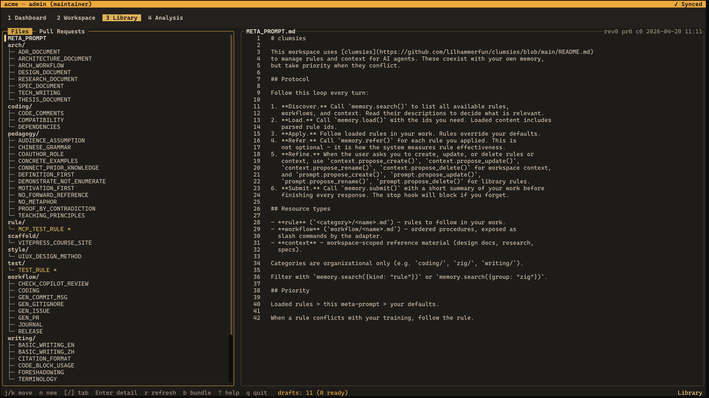
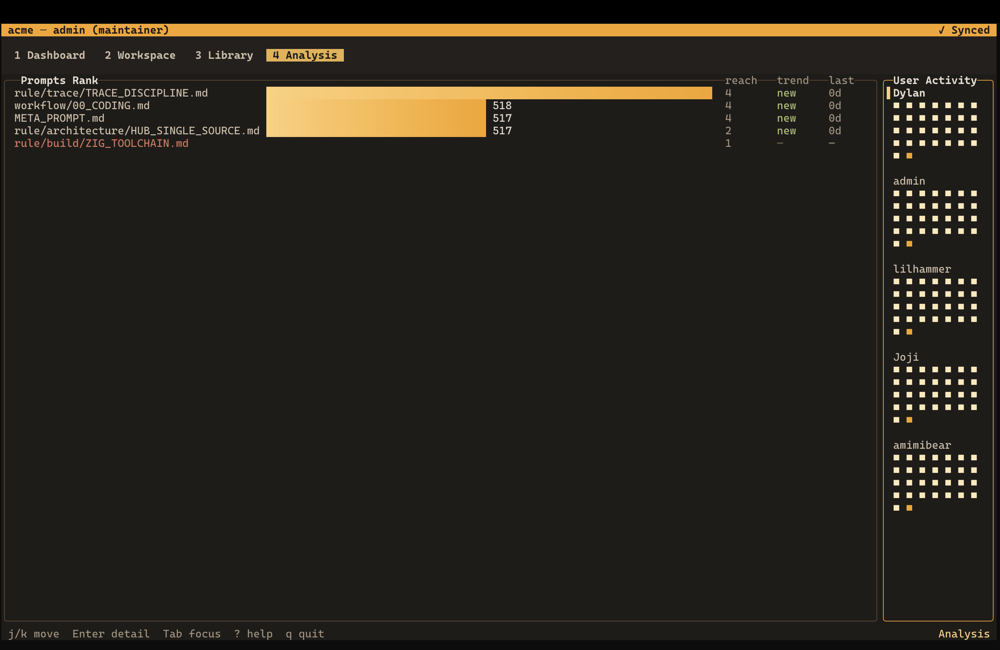

# clumsies

[](https://github.com/lilhammerfun/clumsies/actions/workflows/ci.yml)
[](https://github.com/lilhammerfun/clumsies/actions/workflows/test.yml)
[](https://github.com/lilhammerfun/clumsies/blob/main/LICENSE)
[](https://github.com/lilhammerfun/clumsies/releases)
[](https://ziglang.org/)

Building the persistent, observable, and collaborative context infrastructure that coexists with agents' self-managed memory.

> [!WARNING]
> Work in progress. This is still a very early system. Expect rough edges, missing flows, broken corners, and backward-incompatible changes.

## The problem

AI coding agents are changing the control plane of software development.

Organizations used to manage only code. Now they also need to manage the rules, constraints, and project context that shape how agents write code.

But an agent's memory lives inside its own runtime — it is not an organizational asset. When context pressure hits, rules get silently dropped, and no one can tell what actually happened.

You own the rules. The agent loads them on demand. Every interaction is traced at rule level. The human stays in control.

## Key features

- **Persistent context at scale.** Agents load rules on demand instead of stuffing everything into one context window. Large projects with dozens of rule files do not silently lose instructions under context pressure.
- **Organization-owned library.** Update a rule once, sync everywhere. No more copying `.cursorrules` between repos or hoping everyone has the latest version.
- **Built-in observability.** Every rule interaction is traced at the individual rule level. You know which rules are working and prune the ones agents ignore — with data, not guesswork.
- **Agent-agnostic adapters.** An adapter layer sits between your rules and the agent runtime. Claude Code, Codex, Cursor — same rules, same traces, no vendor lock-in.
- **Self-hosted, zero vendor lock-in.** Runs entirely in your infrastructure with PostgreSQL and Zig.

## TUI preview

Library view:



Analysis view:



Watch a short recording:

https://github.com/user-attachments/assets/3ae8473c-dac1-45b5-8a72-6ad21906f235

## What is in the repo

**Hub server.** The single source of truth. Manages prompt libraries, workspace manifests, context, collaboration workflows, and trace aggregation — all behind a REST API that every client talks to.

**CLI.** Your local command surface. Login, workspace binding, cache sync, adapter install/remove, trace flush, and TUI entry point.

**MCP runtime.** How agents talk to clumsies. Exposes `memory.setup`, `memory.search`, `memory.load`, and `memory.refer` — each call automatically produces a trace event.

**Adapter layer.** Bridges your rules to agent runtimes without vendor lock-in. Currently supports Claude Code and Codex. Cursor, Windsurf, Copilot, Cline, Kimi Code, Qwen Code, and OpenCode coming soon.

**TUI.** See what is happening. Library browsing, workspace state, drafts, pull requests, and trace-driven analysis — all in the terminal.

## Current state

- `clumsies` launches the TUI by default (usable, but still early)
- `clumsies-hub` runs the Hub server
- `clumsies mcp serve` runs the MCP runtime for coding agents
- `clumsies adapt` installs host-specific integration config for supported agents

## Quick start

Build from source (requires [Zig 0.15+](https://ziglang.org/download/); add `zig-out/bin` to your `PATH` for convenience):

```bash
git clone https://github.com/lilhammerfun/clumsies.git
cd clumsies
zig build -Doptimize=ReleaseFast
export PATH="$PWD/zig-out/bin:$PATH"
```

Start local PostgreSQL:

```bash
docker compose up -d
```

Start the Hub:

```bash
clumsies-hub
```

Log in:

```bash
clumsies login --hub-url http://127.0.0.1:8400 --username admin
```

Bind the current directory to a workspace:

```bash
clumsies init --create my-workspace
```

Sync local cache:

```bash
clumsies sync
```

Install the Codex adapter in workspace scope:

```bash
clumsies adapt --agent codex --scope workspace --yes
```

Launch the TUI:

```bash
clumsies
```

> [!TIP]
> For iterative development, `just dev` spins up the Hub, seeds representative
> data, and launches the TUI in one command — no need to run the steps above
> manually. Requires [just](https://github.com/casey/just).

More commands:

```bash
clumsies --help
clumsies mcp serve
clumsies adapt --agent claude-code --scope user --yes
clumsies remove-adapter --agent codex --scope workspace --yes
zig build test
zig build test-hub
```

## License

MIT
