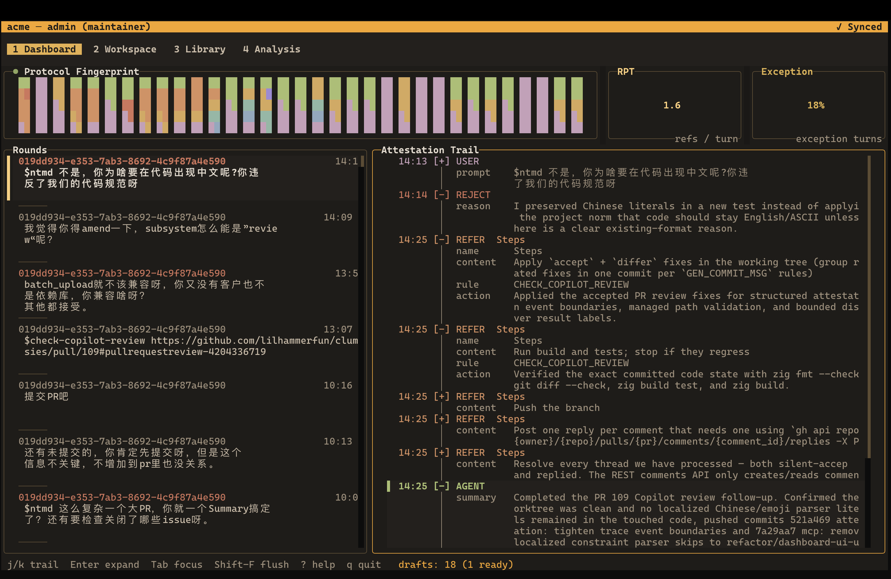
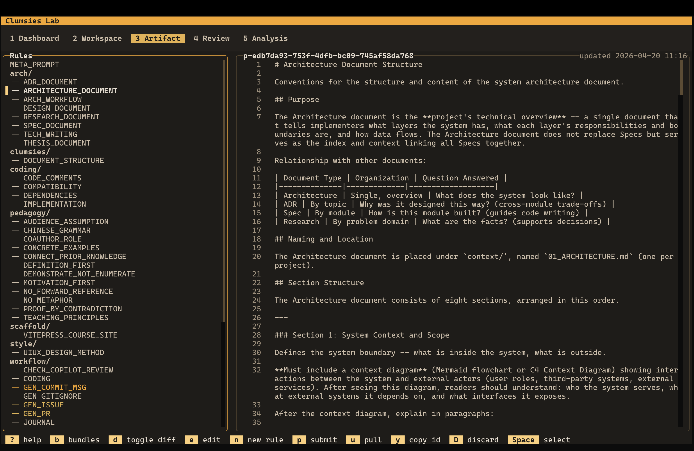
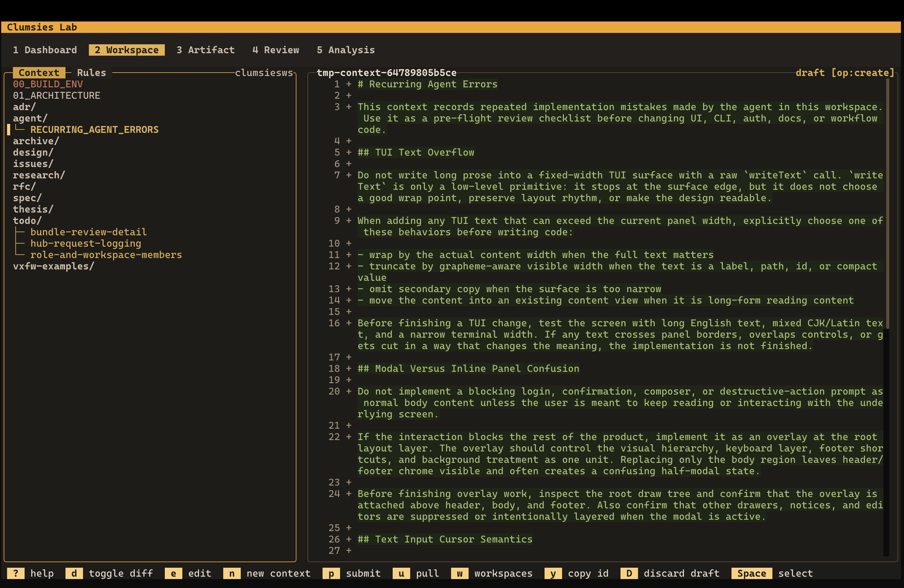

# clumsies

[](https://github.com/lilhammerfun/clumsies/actions/workflows/ci.yml)
[](https://github.com/lilhammerfun/clumsies/actions/workflows/test.yml)
[](https://github.com/lilhammerfun/clumsies/blob/main/LICENSE)
[](https://github.com/lilhammerfun/clumsies/releases)
[](https://ziglang.org/)

Building the persistent, observable, and collaborative context infrastructure that coexists with agents' self-managed memory.

> [!WARNING]
> Work in progress. This is still a very early system. Expect rough edges, missing flows, broken corners, and backward-incompatible changes.

## The problem

AI coding agents are changing the control plane of software development.

Organizations used to manage only code. Now they also need to manage the rules, constraints, and project context that shape how agents write code.

But an agent's memory lives inside its own runtime — it is not an organizational asset. When context pressure hits, rules get silently dropped, and no one can tell what actually happened.

You own the rules. The agent loads them on demand. Every interaction is traced at rule level. The human stays in control.

## Key features

- **Persistent context at scale.** Agents load rules on demand instead of stuffing everything into one context window. Large projects with dozens of rule files do not silently lose instructions under context pressure.
- **Organization-owned library.** Update a rule once, sync everywhere. No more copying `.cursorrules` between repos or hoping everyone has the latest version.
- **Built-in observability.** Every agent interaction is recorded as an attestation event — which constraints were loaded, which were applied, and the agent's self-assessment. The event lifecycle (`user_prompt` → `discover`/`load`/`refer` → `agent_report`) gives you data-driven insight into which rules work and which get ignored. Agent adapters enforce turn closure: the stop hook ensures the agent submits a summary before finishing.
- **Agent-agnostic adapters.** An adapter layer sits between your rules and the agent runtime. Claude Code, Codex, Cursor — same rules, same attestations, no vendor lock-in.
- **TUI-first workspace control.** The terminal UI handles login, workspace creation, path binding, member management, rule import/detach, bundle browsing, and review from one persistent surface.
- **Bundle-based rollout.** Bundle filters let teams browse a named subset of the Artifact library, propose bundle membership changes through PRs, and initialize workspaces with a curated rule set.
- **Self-hosted, zero vendor lock-in.** Runs entirely in your infrastructure with PostgreSQL and Zig.

## TUI preview

Dashboard view:



Artifact view:



Workspace view:



## Quick start

This gets a local clumsies install running for one project. For the product
model and system shape, see the [overview](https://lilhammerfun.github.io/clumsies/overview/)
and [architecture](https://lilhammerfun.github.io/clumsies/architecture/).

Build from source (requires [Zig 0.15+](https://ziglang.org/download/); add `zig-out/bin` to your `PATH` for convenience):

```bash
git clone https://github.com/lilhammerfun/clumsies.git
cd clumsies
zig build -Doptimize=ReleaseFast
export PATH="$PWD/zig-out/bin:$PATH"
```

Start local PostgreSQL:

```bash
docker compose up -d
```

Start the Hub. See the [deployment guide](https://lilhammerfun.github.io/clumsies/guides/deploy-for-an-org/)
for organization bootstrap and self-hosted deployment notes.

```bash
clumsies-hub
```

Sign in:

```bash
clumsies login --hub-url http://127.0.0.1:8400 --username admin
```

Set up the current project for your agent:

```bash
clumsies adapt
```

`adapt` installs the selected agent integration. If the current directory is
not bound to a workspace, the workspace scope can create and bind one for this
project before installing.

Launch the TUI:

```bash
clumsies
```

Use the TUI whenever you want to inspect workspace context, review rules,
check activity, or manage workspaces and members. The
[member workflow guide](https://lilhammerfun.github.io/clumsies/guides/how-to-use-clumsies/)
walks through that day-to-day flow.

`clumsies init` and `clumsies sync` still exist for explicit setup and
automation, but they are no longer required for the normal quick start.

Non-interactive adapter installs are still available:

```bash
clumsies adapt --agent codex --scope workspace --yes
```

Inside the TUI, use Workspace to inspect local context and rules, Artifact to
browse shared rules and bundles, Review to handle PRs, and Settings to manage
account, organization, tokens, members, workspaces, and local path bindings.
For exact command flags, use the [CLI reference](https://lilhammerfun.github.io/clumsies/guides/cli-commands/).

> [!TIP]
> For iterative development, `just dev` spins up the Hub, seeds representative
> data, and launches the TUI in one command — no need to run the steps above
> manually. Requires [just](https://github.com/casey/just).

## License

MIT
