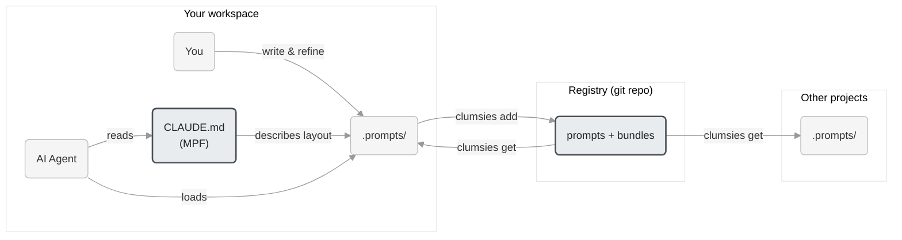

# clumsies

[](https://github.com/lilhammerfun/clumsies/actions/workflows/ci.yml)
[](https://github.com/lilhammerfun/clumsies/actions/workflows/test.yml)
[](https://github.com/lilhammerfun/clumsies/blob/main/LICENSE)
[](https://github.com/lilhammerfun/clumsies/releases/latest)
[](https://ziglang.org/)

User-level memory layer for AI agents.

## The problem

AI coding agents all have memory systems — Claude Code writes to `~/.claude/memory/`, Windsurf stores memories per workspace, Copilot keeps them server-side, Gemini CLI appends to `GEMINI.md`. You can view them, and some tools let you manually add entries.

But unless you actively check and intervene, memory is agent-managed by default. The agent decides what to remember and what to surface. A concrete example: when a conversation exceeds the context window, every major agent compresses or summarizes automatically — Claude Code at ~80% capacity, Cline at ~80%, Amazon Q at ~80%. You can influence the process (Claude Code accepts "Compact Instructions"), but you cannot decide precisely what gets kept and what gets forgotten.

Having a separate, user-level memory layer — one you write, organize, and maintain yourself — ensures the context that matters to you is always there, regardless of what the agent's built-in system does with its own memory.

The second problem is portability. Every tool's memory is project-scoped. At best you get a single global config file. There's no mechanism to selectively reuse pieces across projects.

This matters in practice: you refine prompts through real work — a commit format that catches edge cases, a code review checklist tuned to your team's patterns, testing rules that reflect lessons learned. Over time these become a personal prompt library tied to your role and workflow. But without a way to manage and distribute them, each prompt stays trapped in the project where it was written.

## What clumsies does

Two things, both simple:

**A user-level memory layer.** You write prompts as markdown files in `.prompts/`, organized however you want. A meta-prompt file, or MPF (CLAUDE.md, AGENTS.md, etc.), tells the agent where things are. This sits alongside the agent's built-in memory, not replacing it — giving you a layer you fully control.

**Cross-project portability.** A central registry (a git repo) lets you register prompts, refine them over time, and import them into any project. Your prompt library grows with your practice — update once, pull everywhere.

```
workspace/
├── CLAUDE.md              # MPF — tells the agent where things are
└── .prompts/
    ├── rule/              # Reusable rules (from registry)
    ├── house-rule/        # Project-specific rules
    ├── cmd/               # Procedures (invoke by name)
    ├── context/           # Project knowledge (stays local)
    └── ...                # Whatever else you need
```

The MPF (CLAUDE.md, AGENTS.md, COPILOT.md — whatever your tool reads) describes the `.prompts/` layout in natural language. No special syntax, no tool integration. The agent reads the file, understands the structure, and knows where to find what it needs.

### How it fits together



Prompts get better through real use. You tell the agent "fix this code following rule/coding/ZIG_STYLE", review the output, and find the prompt wasn't specific enough — so you refine it and try again. This cycle repeats until the prompt reliably produces the result you want. Once it's good enough, register it to the registry and reuse it across projects.

You don't have to start from scratch. Good prompts circulate widely — skills marketplaces, GitHub repos, developer communities. They make excellent starting points. But a prompt written for someone else's workflow rarely works perfectly in yours: your team's conventions, your project's constraints, your tool preferences — small differences compound. A shared prompt is a foundation, not a finished product.

This is why clumsies is a personal registry, not a marketplace. The value of a prompt comes from refining it through your own practice. Borrow freely, but own the result.

More on the design in [ARCHITECTURE.md](./ARCHITECTURE.md).

## Install

```bash
curl -fsSL https://raw.githubusercontent.com/lilhammerfun/clumsies/main/install.sh | sh
```

<details>
<summary>Manual install</summary>

```bash
# Download binary and checksums
curl -LO https://github.com/lilhammerfun/clumsies/releases/latest/download/clumsies-darwin-arm64
curl -LO https://github.com/lilhammerfun/clumsies/releases/latest/download/checksums.txt

# Verify and install
shasum -a 256 -c checksums.txt --ignore-missing
chmod +x clumsies-darwin-arm64
mkdir -p ~/.clumsies/bin
mv clumsies-darwin-arm64 ~/.clumsies/bin/clumsies
```

Platforms: `darwin-arm64`, `darwin-x86_64`, `linux-arm64`, `linux-x86_64`
</details>

## Quick start

Get a working prompt setup in 30 seconds, no configuration needed.

```bash
mkdir clumsies-demo && cd clumsies-demo

clumsies get opus-coding --registry https://github.com/lilhammerfun/clumsies-registry.git
```

This creates `.prompts/` with coding rules, reusable commands, and a four-layer architecture workflow (Architecture → ADR → Research → Spec). It also drops a `CLAUDE.md` at the project root that tells your agent where everything is.

Now give your agent a task. Here's an example, or replace it with any project you're interested in:

```
Follow the arch rules to design a local-first AI agent orchestration
framework. It should support multiple LLM backends, tool calling,
streaming output, and conversation memory persistence.
```

The agent reads `CLAUDE.md`, discovers `.prompts/`, and finds the arch rules. You don't need to point it to specific files. That's the whole point of the MPF: it tells the agent where things are so you can talk in natural language.

> The demo prompts are written in Chinese. The agent follows them regardless and responds in whatever language you write your task in. Add "用中文回复" or "Respond in English" if you want to be explicit.

Check if it worked. The agent should have created files following the architecture workflow:

```bash
ls .prompts/context/
# Expected: 01_ARCHITECTURE.md, and possibly adr/, research/, spec/
```

If you see an Architecture document that identifies modules, references ADRs for cross-cutting decisions, and links to Specs, the prompts are working. That structure came from the rules in `.prompts/rule/arch/`, not from the agent's defaults.

### Build your own registry

```bash
# Point to your registry
clumsies config set registry git@github.com:you/prompt-registry.git

# Register prompts you've refined
clumsies add .prompts/rule/coding/

# Import them into another project
clumsies get my-coding-bundle
```

## Registry

The registry is a git repo where prompts are stored by SHA-256 hash — same content, same hash, stored once. Bundles group prompts together for distribution.

```
registry/
├── prompts/
│   ├── index.json
│   └── <sha256>          # Content-addressed, no extension
└── bundles/
    └── index.json
```

Register prompts from any project, import them into any other. Update a prompt in the registry and every project that pulls it gets the change.

## Build from source

Requires [Zig](https://ziglang.org/) 0.15+:

```bash
git clone https://github.com/lilhammerfun/clumsies.git
cd clumsies
zig build -Doptimize=ReleaseFast
```
