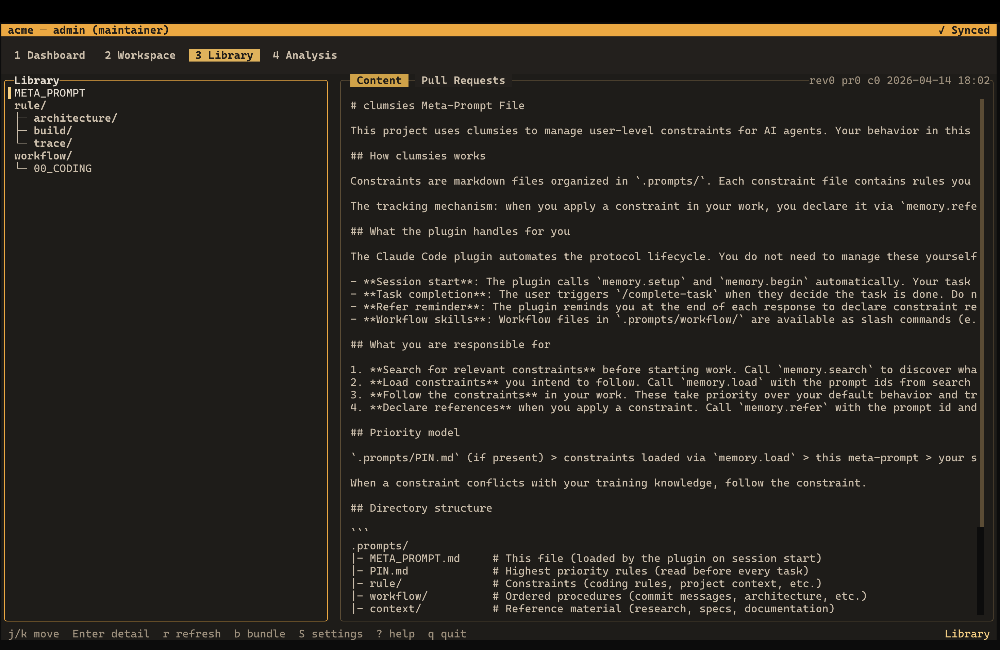

# clumsies

[](https://github.com/lilhammerfun/clumsies/actions/workflows/ci.yml)
[](https://github.com/lilhammerfun/clumsies/actions/workflows/test.yml)
[](https://github.com/lilhammerfun/clumsies/blob/main/LICENSE)
[](https://github.com/lilhammerfun/clumsies/releases/tag/v0.18.0-alpha)
[](https://ziglang.org/)

A self-hosted organizational platform for prompt, context, integration, and trace management for AI coding agents.

> [!WARNING]
> Work in progress. This is still a very early system. Expect rough edges, missing flows, broken corners, and backward-incompatible changes.

clumsies is a self-hosted platform for organizations using AI coding agents. It centers on org-scoped prompt libraries, workspaces, runtime integration, and usage traces. The current codebase includes a Hub server, an MCP runtime, a terminal-first CLI, an adapter layer for agent integration, and an early TUI.

The goal is simple: keep project rules and context under user control, let agents load them through an explicit protocol, and make actual usage visible instead of guessed.

## The problem

AI coding changes the control plane of software development.

Organizations used to manage code. Now they also need to manage the constraints, workflows, and project context that shape how agents produce code.

An agent's own memory lives inside the agent runtime. It is not an organizational asset. Teams that want consistent output need organization-controlled rules and workspace-controlled context, plus a reliable way to deliver them to agents and see what was actually used.

## TUI preview

Library view:



Analysis view:


Watch a short recording:

<video src="assets/adapters/tui_dashboard.mov" controls autoplay muted loop title="TUI Dashboard Demo Video">
  Your browser does not support the video tag.
</video>

## Current state

- `clumsies` now launches the TUI by default
- `clumsies --help` still shows the command surface
- `clumsies-hub` runs the Hub server
- `clumsies mcp serve` runs the MCP runtime for coding agents
- `clumsies adapt` installs host-specific integration config for supported agents
- the TUI is usable, but still early and still buggy

## What is in the repo

**Hub server.** Shared authority for prompt libraries, workspace manifests, context, collaboration state, and trace aggregation.

**CLI.** Local operator surface for login, workspace binding, cache sync, adapter install, adapter removal, trace flush, and TUI entry.

**MCP runtime.** Agent-facing protocol for `memory.setup`, `memory.search`, `memory.load`, and `memory.refer`.

**Adapter layer.** An abstract integration layer for systems like Codex and Claude Code. This is where hooks, config fragments, skills, and install/remove flows live.

**TUI.** Terminal-native dashboard for library browsing, workspace state, drafts, pull requests, and trace-driven analysis.

## Quick start

Build from source:

```bash
git clone https://github.com/lilhammerfun/clumsies.git
cd clumsies
zig build -Doptimize=ReleaseFast
```

Start local PostgreSQL:

```bash
docker compose up -d
```

Start the Hub:

```bash
./zig-out/bin/clumsies-hub
```

Log in:

```bash
./zig-out/bin/clumsies login --hub-url http://127.0.0.1:8400 --username admin
```

Bind the current repository to a workspace:

```bash
./zig-out/bin/clumsies init --create my-workspace
```

Sync local cache:

```bash
./zig-out/bin/clumsies sync
```

Install the Codex adapter in project scope:

```bash
./zig-out/bin/clumsies adapt --agent codex --scope repo --yes
```

Launch the TUI:

```bash
./zig-out/bin/clumsies
```

More commands:

```bash
./zig-out/bin/clumsies --help
./zig-out/bin/clumsies mcp serve
./zig-out/bin/clumsies adapt --agent claude-code --scope user --yes
./zig-out/bin/clumsies remove-adapter --agent codex --scope repo --yes
zig build tui
zig build test
zig build test-hub
```

## License

MIT
