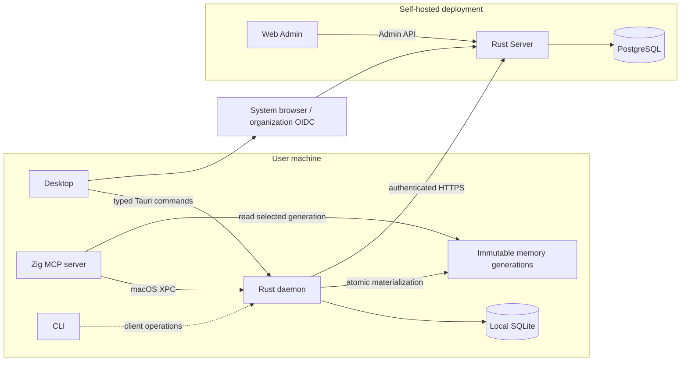
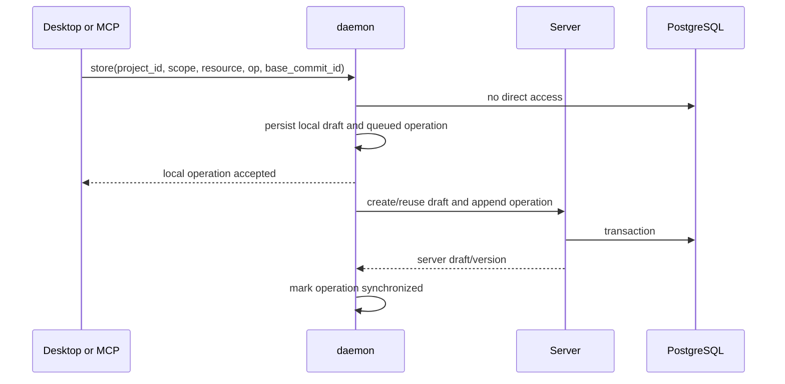
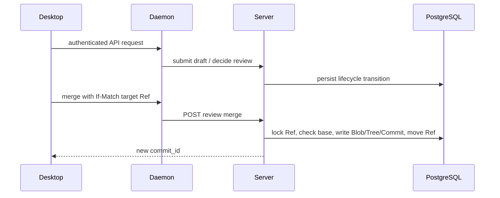
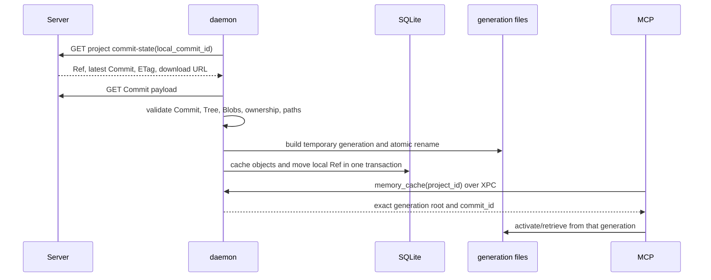

# Architecture

## System boundary

## Why Desktop and daemon both exist

A browser cannot reliably own arbitrary local project files or remain available
when its page is closed. Desktop provides the native user experience and local
file access; daemon provides a lifecycle independent from whether the Desktop
window is open.

For example, an MCP `store` call can create a draft while Desktop is closed.
Daemon persists and synchronizes it. When Desktop opens later, it reads the same
draft queue. Conversely, a draft edited in Desktop remains available to MCP
because it was not stored in renderer state.

## Ownership

| Component | Owns | Does not own |
| --- | --- | --- |
| Server | authority resources, identity, authorization, review state, Commit graph, audit | local files and client process lifecycle |
| daemon | local drafts, queued operations, cached Blob/Tree/Commit objects, installed Refs, immutable generations, refresh handling, native Server proxy | authority decisions and merge policy |
| Desktop | interaction state, editors, navigation, review workflows | bearer tokens and durable authority |
| MCP | activation/retrieval protocol and agent-originated store calls | a parallel draft database |
| Web Admin | administrative operations | memory editing and review workflows |

## Write path

The first response is local acceptance, not publication. Automatic sync retries
failed operations. Desktop can inspect pending, failed, or conflicted state.

## Review and merge path

Organization and project Refs are independent. Merging a Hub draft advances the
organization Ref only; merging a Local draft advances the selected project Ref
only.

## Authority read path

The SQLite Ref is the only mutable local pointer. MCP never scans old cache
locations or falls back to a previous workspace cache when daemon has no ready
generation.

## Authentication boundary

Desktop native Rust owns the browser loopback listener and PKCE verifier. After
the code exchange and `/api/v1/me` lookup succeed, native Rust sends the token
pair directly to daemon. Renderer JavaScript never sees either token.

Daemon injects bearer tokens into Server requests. On `401`, it rotates the
refresh token and retries exactly once.

## Platform boundary

The current daemon transport is macOS launchd plus XPC under bundle identifier
`io.github.lilhammerfun.clumsies`. Windows is a later roadmap item and will need
a native service manager and IPC transport behind the same daemon capability
contract. It is not implemented as a degraded fallback.

## Incomplete boundary

Draft upload, remote draft projection, Commit download, atomic local
materialization, and MCP authority reads are operational. Open drafts are not
yet overlaid onto the immutable authority generation used by MCP. Type-aware
three-way merge, user-resolvable conflicts, Keychain token storage, and Windows
service transport are also outside the implemented boundary.
