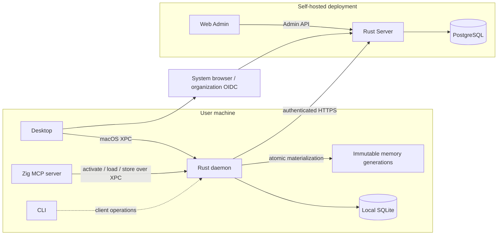
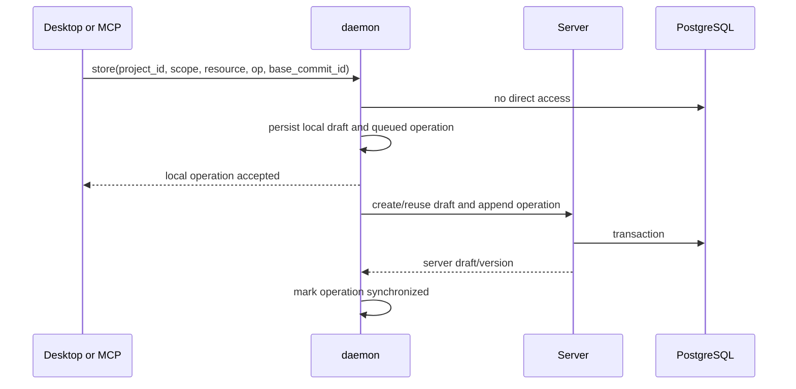
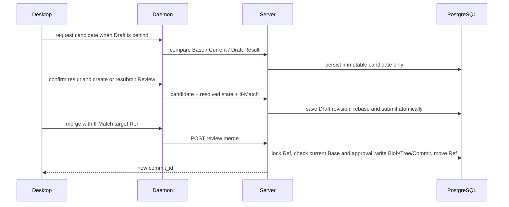
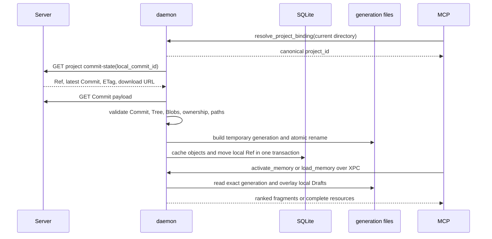

# Architecture

## System boundary



## Why Desktop and daemon both exist

A browser cannot reliably own arbitrary local project files or remain available
when its page is closed. Desktop provides the native user experience and local
file access; daemon provides a lifecycle independent from whether the Desktop
window is open.

For example, an MCP `store` call can create a draft while Desktop is closed.
Daemon persists and synchronizes it. When Desktop opens later, it reads the same
draft queue. Conversely, a draft edited in Desktop remains available to MCP
because it was not stored in renderer state.

## Ownership

| Component | Owns | Does not own |
| --- | --- | --- |
| Server | authority resources, identity, authorization, review state, Commit graph, audit | local files and client process lifecycle |
| daemon | local Project bindings, local drafts, queued operations, cached Blob/Tree/Commit objects, installed Refs, immutable generations, refresh handling, native Server proxy | authority decisions and merge policy |
| Desktop | interaction state, editors, navigation, review workflows | bearer tokens and durable authority |
| MCP | activation, exact loading, and agent-originated store calls | a parallel draft database or search implementation |
| Web Admin | administrative operations | memory editing and review workflows |

## Write path



The first response is local acceptance, not publication. Automatic sync retries
failed operations. Desktop can inspect pending/failed sync separately from
behind/conflicts coordination; neither coordination state blocks editing.

## Review and merge path



Organization and project Refs are independent. Merging a Hub draft advances the
organization Ref only; merging a Local draft advances the selected project Ref
only.

## Authority read path



The SQLite Ref is the only mutable authority pointer. Moving it does not move a
Draft Base. Search heads are local derived pointers bound to an Effective Memory
hash. For Draft resources, that memory uses `Base + operations`; for all other
resources it uses the latest installed Commit. MCP never scans cache files or
falls back to an old generation when daemon has no matching ready index.

## Local Project binding

The Server connection, the Desktop-selected Project, and a local directory
binding are separate state:

```text
Server authority + credentials
Local canonical workspace root -> canonical project_id
Desktop selected project_id (UI only)
```

Daemon persists bindings in SQLite under the normalized Server authority and
resolves the longest canonical ancestor of the MCP working directory. Commit
sync enumerates all bound Projects, so two MCP processes can use different
Projects concurrently while Desktop is closed or displaying a third Project.
Legacy `ws_id` configuration is only a one-time name-and-path migration source;
it is not part of the runtime identity model.

## Authentication boundary

The native macOS app owns the browser loopback listener and PKCE verifier. After
the code exchange and `/api/v1/me` lookup succeed, the app sends the token pair
directly to daemon over XPC.

Daemon injects bearer tokens into Server requests. On `401`, it rotates the
refresh token and retries exactly once.

## Platform boundary

The current daemon transport is macOS launchd plus XPC. Its LaunchAgent label
and Mach service are both `ai.clumsies.daemon`, under the `ai.clumsies` product
namespace. Windows is a later roadmap item and will need a native service
manager and IPC transport behind the same daemon capability contract. It is not
implemented as a degraded fallback.

## Incomplete boundary

Draft upload, remote projection, Commit download, atomic local materialization,
Effective Memory Draft overlay, canonical three-way reconciliation, explicit
rebase, Review freshness, hybrid retrieval, exact loading, activation delta, and
macOS Keychain token storage are operational. A representative versioned
retrieval query set and Windows service transport remain outside the implemented
boundary.
