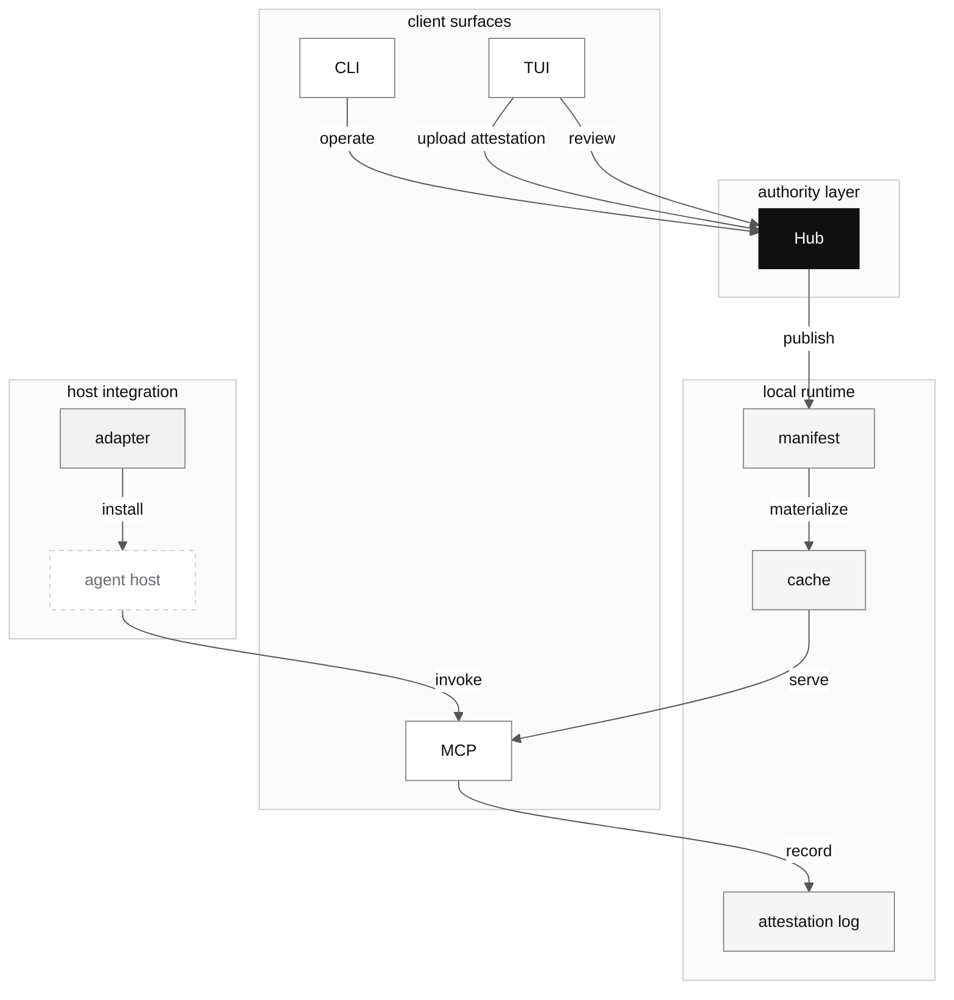
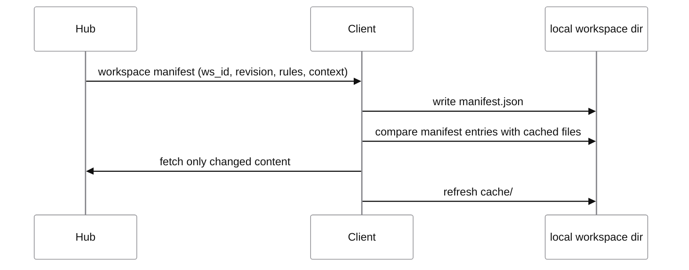

# Architecture

## Read clumsies as a Hub-centered system

The cleanest way to read this project is to start from one rule: Hub is the authority layer. It owns business objects, revision history, membership, collaboration state, and the server-side meaning of a workspace. CLI, MCP, TUI, and adapters are all client or integration surfaces around that authority.

This matters because the repository still contains local-runtime-era shapes alongside the newer Hub-first design. If the docs flatten those into one vague "tooling" bucket, the system looks far more ad hoc than it actually is.

## The stable architectural split



The diagram should read top to bottom without any guesswork. Hub is the only authority layer. The local runtime is a synchronized execution surface. CLI, TUI, and MCP are different interfaces over that system. Adapter exists to make the host actually reach the local runtime in practice.

If the short labels look too terse on their own, read them as:

| Diagram label | Meaning |
| --- | --- |
| `Hub` | orgs, Artifact, workspaces, attestation ingest |
| `manifest` | `manifest.json`, the current workspace snapshot |
| `cache` | materialized local rules, context, and `META_PROMPT` |
| `attestation log` | append-only local runtime events awaiting TUI upload |
| `MCP` | the current `mem*`, `artifact`, and agent-reporting tool surface |
| `adapter` | plan, install, update, and remove logic for host integration |

## What each layer owns

The main design boundary is not "server versus client." It is "authority versus execution."

| Layer | Owns | Does not own |
| --- | --- | --- |
| Hub | orgs, users, workspace identity, Artifact state, manifest revision, collaboration, attestation ingest | repo-local config, host-specific hook files, local cache layout |
| local runtime | synced snapshot of one workspace, materialized content, buffered runtime state | source-of-truth object identity, review state, server-side authorization |
| CLI | human operational entry points such as login, init, sync, adapt | business truth beyond what Hub exposes |
| MCP | agent-facing discovery and load path over local runtime | canonical server-side object model |
| TUI | dense human-facing dashboard and review surface | separate business logic |
| adapter | host integration and removal safety | Hub authority, MCP protocol semantics |

Once this table is clear, the rest of the architecture stops feeling mysterious. Most confusion comes from expecting CLI or MCP to own semantics that belong in Hub, or from expecting Hub to care about host-level files that belong in adapter runtime.

## The three product pillars

The architecture documents keep circling the same three pillars because they are the shortest honest description of what the product is trying to become.

| Pillar | Core objects | Why it exists |
| --- | --- | --- |
| rule lifecycle management | Artifact, rule, workflow, bundle, proposal, PR | shared behavior assets should be reviewable and reusable |
| context management | workspace, context, workspace membership | project knowledge should stay attached to the project boundary |
| observability | attestation, stats | usage should produce evidence, not just folklore |

This is why clumsies is not just a prompt folder, and not just a local MCP cache. It is trying to keep behavior, project knowledge, and runtime evidence inside one system model.

## Object model and ownership

The important ownership split is between Artifact-backed behavior and workspace-owned knowledge.

| Object | Authority | Runtime role |
| --- | --- | --- |
| rule | Artifact | behavioral instruction |
| workflow | Artifact | reusable workflow asset |
| bundle | Artifact | named selection unit for rules and workflows |
| workspace | Hub | project boundary |
| context | workspace | project-specific factual knowledge |
| manifest | Hub-generated for a workspace | local sync index |
| attestation | Hub aggregate plus local buffer | runtime evidence |

Two consequences fall out of this immediately.

First, context is not part of Artifact. It may look similar on disk because both rules and context become files inside cache, but they do not share an ownership model. A rule is an org-level behavioral asset. Context is workspace knowledge.

Second, workspace is not just a local folder binding. A workspace can bind more than one local path. The server-side workspace ID is the identity; the local path is only a binding.

## Collaboration paths are intentionally split

The architecture keeps two collaboration routes separate on purpose.

### Artifact collaboration

Rules, workflows, and bundles live in Artifact. They go through proposal, review, and merge flow because they are meant to become shared behavioral assets.

### Workspace collaboration

Context edits belong to the workspace side. They still need review and PR semantics, but they merge into workspace-owned mainline rather than back into Artifact.

If public docs blur those two routes, users stop seeing why Artifact exists and why workspace context is not just "private rules."

## Why manifest exists

The sync protocol is manifest-driven because every client surface needs the same indexed picture of a workspace.



Without manifest, each client would need its own discovery logic. With manifest, sync becomes a single explicit protocol.

The current implementation writes this snapshot to:

```text
~/.clumsies/workspaces/{ws_id}/manifest.json
```

That file is not a decorative cache marker. It is the local index for the current workspace snapshot. In the current code, it contains:

- `ws_id`
- `name`
- `revision`
- `rules`
- `context`

The last two are stable-ID keyed object maps. That choice is a real design decision, not a schema accident. Identity should survive path rename. The system needs to know that a file moved, not pretend a delete-plus-create happened every time a path changes.

## Why cache exists

The cache layer is there because runtime work should stay local once sync has established the current snapshot.

That local runtime serves at least three jobs:

1. MCP can answer agent search and load calls without blocking on Hub.
2. CLI and TUI can inspect current workspace content from local state.
3. agent bootstrap can resolve files such as `META_PROMPT.md` from a stable workspace cache path.

The current workspace cache root is:

```text
~/.clumsies/workspaces/{ws_id}/cache/
```

Inside that cache, the runtime materializes at least:

- `rule/`
- `context/`
- `META_PROMPT.md`

This means the architecture has a deliberate two-layer local model:

| Local file | Meaning |
| --- | --- |
| `manifest.json` | what the workspace currently contains |
| `cache/` | the actual local content addressed by that snapshot |

That split is why sync can stay incremental. The client compares manifest hash entries to the files already in cache and refetches only what changed.

## Authority versus execution

The hard boundary is easy to say but worth repeating: Hub is the source of truth. Local runtime is an execution surface.

That boundary protects the product from two bad outcomes.

If everything became remote, every agent operation would block on network round-trips. If everything became local, every host would silently fork its own truth model. The manifest-plus-cache design is the compromise that keeps runtime fast without giving up shared authority.

## MCP and adapter are different layers

MCP and adapter are easy to conflate because both sit close to agent runtime. They do different jobs.

| Layer | Question it answers |
| --- | --- |
| MCP | how does an agent search, load, and refer to workspace material |
| adapter | how does this host get configured so the right MCP path is available at all |

Current docs should keep one implementation fact explicit: the running tool surface is `memsetup`, `memdisc`, `memload`, `memref`, `artifact`, `agentreport`, and `agentrejected`. Public docs should describe that as the real protocol surface rather than as a temporary alias for some other namespace.

Adapter should also be treated as a first-class architectural layer. For Codex, runtime depends on `.codex/config.toml`, `.codex/hooks.json`, hook scripts, and optional local skills. That is not setup trivia. It is the installable host-facing part of the system.

## Attestation is part of the architecture, not an add-on

Older material still says trace. Current implementation is moving toward attestation. The architectural idea is the same: runtime actions should leave evidence.

That evidence is not only a server-side concern. The runtime model includes local buffering and later upload because synchronous write-through to Hub would make agent execution slower and more fragile.

So the observability path is also split:

1. runtime events happen locally
2. events are buffered locally
3. Hub ingests, deduplicates, and aggregates later

This is why observability belongs in the core architecture. It is built into the runtime path, not bolted on as analytics after the fact.

## Current implementation versus target architecture

The docs need to be honest about the transition.

### Stable already

The following boundaries are already stable enough to document as product truths:

- Hub is the authority layer.
- Artifact and workspace have different ownership models.
- manifest drives sync.
- local cache exists for non-blocking runtime.
- adapter is a real host integration layer.

### Still tightening

Some surfaces are still mid-transition:

- terminology is moving from prompt to rule where the meaning is behavioral instruction
- terminology is moving from trace to attestation
- MCP uses concise `mem*`, `artifact`, and agent-reporting tools in the current implementation
- local runtime details still carry earlier design assumptions in a few places

That is normal. The right public-doc move is not to hide it. The right move is to separate current implementation, stable boundary, and target direction whenever those diverge.
