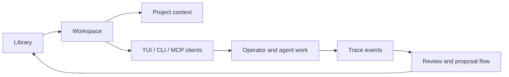

# Architecture

## Read clumsies as a system in transition

The cleanest way to understand clumsies is not to force it into a single box. It currently spans two overlapping layers:

| Layer | What exists now | What it is moving toward |
| --- | --- | --- |
| Current runtime | local `.prompts/`, registry-backed assets, CLI flows, MCP surfaces, local trace | a usable operational surface for prompt-aware work today |
| Hub architecture | early hub modules, shared identifiers, stronger object boundaries | a Library / Workspace / Trace system with a TUI-first client |

That tension is not accidental. It is the actual shape of the project at this stage.

## Current implementation surface

Today the main repository already contains real operational pieces:

- CLI entrypoints and automation-oriented subcommands
- MCP interfaces for agents
- sync, registry, and seed flows
- local prompt loading and local trace handling

At the same time, the fully realized dashboard experience is still emerging. The code already points toward a stronger terminal product, but that client surface is not the whole story yet.

## The target model

The target system settles around a small set of stable objects:

| Object | Responsibility |
| --- | --- |
| Hub Server | the authoritative coordination point for shared state and lifecycle operations |
| Library | the organization-level source of prompts, bundles, and proposals |
| Workspace | the project boundary that selects prompts and carries project context |
| Trace | the structured usage signal that shows what was actually loaded, cited, and improved |
| Client surfaces | the operator and agent interfaces that act on top of those objects |

## System flow

1. Library publishes prompts as shared organizational assets.
2. Workspace selects the subset it actually needs and binds project context around it.
3. Operators and agents consume those prompts through local tools, MCP, and client surfaces.
4. Trace records what was actually used.
5. Review and proposal loops feed useful changes back into Library.

## TUI ambition

The terminal interface is not a cosmetic extra. It is where the product wants dense operational work to happen:

- browsing and curating library content
- managing workspace bindings and local overrides
- reviewing trace and proposal signals
- operating the hub without bouncing across fragmented tools

The key point is that TUI is the main client direction, not the entire architecture. The server, object model, and lifecycle still need to stand on their own.

## How to read the code through this lens

When the codebase feels split, read it as a migration path rather than a contradiction. Some modules support the current usable surface. Others are shaping the Hub / Library / Workspace / Trace model that the project is converging on.
