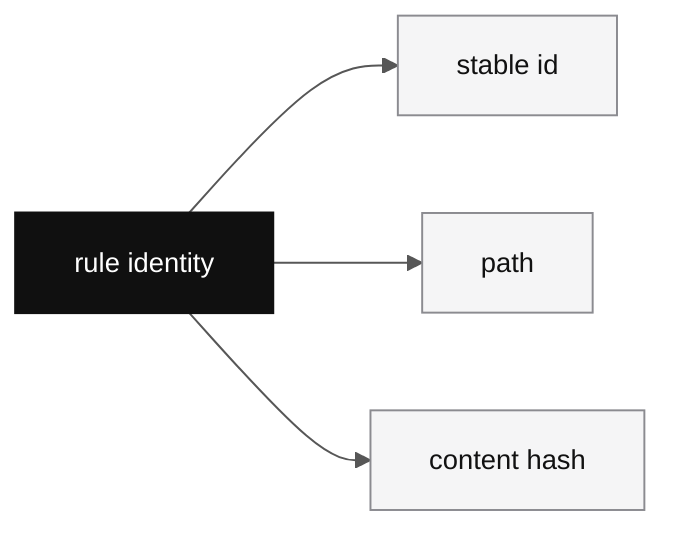

# Artifact

## What Artifact is

Artifact is the organization-level source of rules and workflows. It is the place where behavioral content becomes shared infrastructure instead of scattered local files.

That definition has two consequences. First, Artifact is authoritative. Second, workspaces do not own Artifact behavior content. They only select a subset of Artifact content and keep following it.

## What Artifact owns

Artifact owns the metadata and lifecycle around its behavioral content:

| Thing | Why it matters |
| --- | --- |
| stable prompt identity | trace and history need a key that survives renames |
| current path | people still need a readable location in the rule and workflow tree |
| current content hash | version identity is content-based, not semver-based |
| review history | rule changes are not supposed to drift in silently |
| bundle membership | teams still need useful groupings even if bundles are not the source of truth |

The cleanest way to say it is this: Artifact owns rule truth, not just file storage.

## Why Artifact has to be authoritative

The architecture docs are explicit about the failure mode that Artifact fixes. If every workspace keeps an unrelated local rule copy, then:

- cross-workspace convergence disappears
- rule history gets tied to file layout accidents
- trace aggregation loses a stable join key
- useful rule improvements stay trapped inside one project

Artifact exists to stop that drift.

## Rule and workflow

Artifact content splits into two major behavioral shapes:

| Kind | Meaning |
| --- | --- |
| rule | an individual behavioral constraint |
| workflow | an ordered constraint sequence that implies execution flow |

That split matters because the runtime does not treat them the same way. A workflow can become a skill or command surface. A rule is plain behavioral guidance loaded into an agent task.

## Prompt identity

The project is explicit about one architectural choice: path is not identity.

Prompt identity is stable and server-issued. Path is mutable. That keeps rename and content reorganization from destroying trace continuity or review history.

This is one of the most important model choices in the system. If docs flatten that distinction, later pages about workspace sync and trace stop making sense. The docs should still keep using `rule` when they mean a single behavioral instruction, even though the identity system retains the broader `prompt` term.

## Reserved paths

Artifact also carries a small number of special paths. The most important one is `META_PROMPT.md`.

That file is not just another rule. It is bootstrap material. It exists so session start can inject the meta-prompt layer before normal task-specific loading begins.

## Review and propagation

Artifact does not accept silent direct mutation as a product principle. Rule and workflow changes are supposed to move through review flow and then propagate outward.

The intended propagation model is:

1. rule change lands in Artifact
2. affected workspace manifests update
3. clients see manifest revision change
4. local cache refreshes
5. later runtime loads see the new content hash

That is the real reason Artifact is a system object instead of a folder name.

## Bundles are views, not truth

Bundles matter, but they are not the primary storage object. A bundle is a logical grouping of Artifact rules and workflows used for initialization or distribution convenience.

That means:

- rules and workflows can exist without any bundle
- the same rule or workflow can appear in more than one bundle
- changing bundle membership does not redefine prompt identity

If a reader mistakes bundle membership for rule ownership, the system starts to look much more arbitrary than it actually is.

## Bundle operations in the TUI

The Artifact screen treats bundle as a browsing and composition mode. `All
rules` shows the full Artifact library. Choosing a bundle changes the tree to
that bundle's rule set.

Bundle membership changes still use review. In `All rules`, selector mode can
choose multiple rules and propose adding them to a bundle. In a bundle view,
selector mode can choose multiple rules and propose removing them from that
bundle. The resulting change is a rule PR targeting bundle membership, not a
silent local edit.

The same bundle object is used by workspace creation. A workspace can start
with a selected bundle, which seeds its manifest and local cache with that
bundle's rules.
