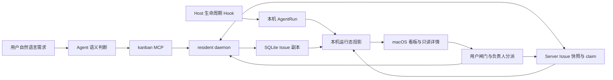

# 原生 Issue 看板设计

本文描述当前实现的持久化、同步和失败边界。产品约束与验收标准见
[《原生 Issue 看板需求》](./issue-board-requirements.md)，MCP 请求格式见
[《MCP》](./mcp.md)。

## 1. 责任模型



Agent 编写语义内容，Hook 只观察执行，用户只批准或拒绝窄状态转换。Server 保存
团队共享的 Issue、负责人和 claim；daemon 保存可执行的本地副本与本机 AgentRun，
并把二者组合成当前安装看到的看板。

Issue 与 Memory 是两条独立的数据链。Issue 不参与 Draft、Commit、Ref、Effective
Memory 或检索索引；旧 Memory Issue 只允许一次性复制，之后不再互相驱动。

## 2. 权威矩阵

| 对象 | 权威 | 副本或派生数据 | 说明 |
| --- | --- | --- | --- |
| Issue 内容、状态、修订、验收标准和事件 | Server PostgreSQL | daemon SQLite | `kanban_issues` 是共享持久记录；`native_issues` 是本机副本和本地事务载体 |
| 负责人 | Server PostgreSQL | daemon 返回模型 | 负责人必须是未禁用的 Project 成员，不参与内容修订 |
| claim | Server PostgreSQL | daemon 每次列出时读取 | 跨用户、跨安装的短租约；不等同于负责人或状态 |
| AgentRun 与 AgentRun event | daemon SQLite | 看板 active/latest/stale 投影 | 只对当前安装有权威性 |
| Abandoned | 无持久记录 | daemon 派生 | stale In Progress Issue 的展示列 |
| blocked 与 blocking reasons | Issue 依赖和阻塞事实 | daemon 派生 | 依赖状态变化后按读取结果重新计算 |
| 旧 `issues/*.md` | Memory | 一次性导入输入 | 导入后不再参与 Issue 行为 |

## 3. Server 持久模型

### 3.1 Issue 快照

Server 的 `kanban_issues` 为每个 Project 保存一条可共享的持久记录：

```text
project_id
issue_id                 全局 `issue_` + 32 位十六进制标识
issue_number             Project 内 1...999
assignee_user_id         Project member
content_revision         大于 0 的乐观并发修订
payload                  JSONB Issue 快照
created_at / updated_at
PRIMARY KEY (project_id, issue_id)
UNIQUE (project_id, issue_number)
```

当前 payload 对应 `ServerKanbanIssueSnapshot`，包含完整 `IssueBoardCard` 和验收标准。
Server 校验路径、记录和 payload 内的 `project_id`、`issue_id`、`issue_number`、
`state_revision` 完全一致，并限制快照序列化后不超过 512 KiB。

负责人位于记录顶层，不属于 payload 内容修订。首次导入 Issue 时，当前登录用户成为
负责人；`PUT .../assignee` 只接受当前 Project 的未禁用成员。负责人变更不代表取得
执行 claim，也不限制其他 Project 成员按接口权限更新 Issue。

相关 Public API 是：

```text
GET    /api/v1/projects/{project_id}/issues
POST   /api/v1/projects/{project_id}/issues
PUT    /api/v1/projects/{project_id}/issues/{issue_id}
DELETE /api/v1/projects/{project_id}/issues/{issue_id}
PUT    /api/v1/projects/{project_id}/issues/{issue_id}/assignee
```

所有请求先验证 bearer principal 是该 Project 的成员。OpenAPI 文件是线协议的权威，
本文只说明行为语义。

### 3.2 共享 claim

`issue_claims` 为每个 `(project_id, issue_id)` 保存至多一个执行租约：

```text
project_id / issue_id / issue_key
claimant_user_id
run_id
claimed_at / lease_expires_at / updated_at
PRIMARY KEY (project_id, issue_id)
FOREIGN KEY (project_id, issue_id) -> kanban_issues
```

申请租约时，Server 接受三种情况：当前没有 claim、已有 claim 已过期、或同一
claimant 与 `run_id` 续期。其他活跃 claim 返回冲突。租约必须在未来且最多延伸
24 小时。释放操作只有匹配 claimant 与 `run_id` 才能删除记录；删除 Issue 会级联
删除 claim。

相关 API 是：

```text
GET    /api/v1/projects/{project_id}/issue-claims
POST   /api/v1/projects/{project_id}/issues/{issue_id}/claim
DELETE /api/v1/projects/{project_id}/issues/{issue_id}/claim
```

claim 只解决“谁现在正在执行”这一跨安装互斥问题，不是锁定 Issue 内容的长事务。
内容并发仍由修订 CAS 解决；租约到期也不会自动改变 Issue 状态。

## 4. daemon 本地模型

### 4.1 Issue 副本

daemon 的中心 SQLite 使用 `native_issues` 保存本地副本和本地事务状态：

```text
issue_id / project_id / issue_number
title / description / acceptance_criteria_json
external_references_json
status / revision / changed_by_run_id / closure_summary
verification_level / verification_steps_json
created_at / started_at / updated_at / closed_at / archived_at
```

Project 级子表保存：

- `issue_dependencies`：同 Project 的依赖边；
- `issue_blocking_facts`：可检查阻塞事实；
- `issue_state_events`：状态转换时间线；
- `native_issue_imports`：旧 Memory Issue 的一次性导入标记。

`native_issues` 仍承载命令的本地原子校验和写入，但不再是团队唯一权威。Server 返回
快照后，daemon 校验 Project、Issue 身份和修订，再 upsert 主表并按整个 Project
重建依赖、阻塞事实和状态事件。

### 4.2 AgentRun

`agent_runs` 和 `agent_run_events` 记录当前安装观察到的执行：host、host run key、
session、父子关系、phase、outcome、摘要、修订、活动时间和 lease。`issue_number`
把一次执行关联到本地 Issue 副本；Hook 事件本身不改变 Issue 状态。

AgentRun 是本机权威。Server payload 的结构目前复用了 `IssueBoardCard`，因此可能携带
产生快照时的 run 投影字段；读取 Server 记录时，daemon 会清空其中的
`active_runs`、`latest_run` 和 `is_stale`，再用本机 AgentRun 重算。远端
`changed_by_run_id` 只有在当前 Project 的本机 `agent_runs` 中确实存在时才保留。

Hook 输入在进入数据库前只保留有界的生命周期标识和摘要，不保存原始提示词、
transcript、工具 body 或 assistant 消息。

## 5. 身份、修订与时间

Issue 有两种身份：

- `issue_id` 全局唯一，是用户从 Kanban 复制后给 Agent 查询的值；
- `ISSUE-NNN` 便于阅读，但只在 `project_id` 内唯一。

本地 `native_issues.revision`、payload 内 `state_revision` 和 Server
`content_revision` 在正常发布路径上保持相等。更新请求携带
`expected_content_revision`；Server 只在当前修订等于预期值时写入，否则返回版本
冲突。daemon 的语义更新和状态闸门也先校验客户端给出的本地预期修订。

负责人和 claim 不属于 Issue 内容修订：负责人变更是独立 Server 写入，claim 使用
独立租约。它们不能代替 CAS，也不会推进状态。

时间字段语义如下：

- `created_at` 创建后不变；
- `started_at` 只由第一次 `begin_work` 写入，不由 Hook 推导；
- `closed_at` 只由用户 `approve_closure` 写入；
- Request Changes 保留 `started_at`；Reopen 清除当前周期的开始和关闭时间；
- UI 将 `started_at` 显示为 Opened，不合成持续时间；旧数据缺失时保持未知。

## 6. 读取与首次导入流程

### 6.1 看板读取

`list_issue_board` 的顺序是：

```text
确认旧 Memory Issue 已做一次性本地导入
  -> 读取本地 Issue 与本机 AgentRun
  -> Server ready 时 GET Project Issues
  -> 必要时把已有本地 Issue 首次导入空的 Server Issue 集
  -> 校验并同步 Server 快照到本地 SQLite
  -> 以 Server Issue 集和 assignee 组成共享看板
  -> 叠加本机 active/latest/stale 投影
  -> GET 当前有效 claims
  -> 返回看板、claims 与未关联 AgentRuns
```

只有在 Server Issue 集为空且本地已有 Issue 时，daemon 才执行 authority bootstrap
导入；这防止一个旧安装覆盖已经存在的团队数据。新建 Issue 则立即通过同一 import
API 写入 Server。

Server 未 ready 时，读取退化为本地 Issue 和本机 AgentRun，claims 为空。Server 已
ready 但请求失败时，调用返回错误；macOS 看板保留最后一次成功响应并向用户提供重试，
而不是把失败包装成最新团队数据。

`get_issue_detail`、`get_issue` 和 `export_issue` 从本地副本读取，不会在每次调用前
单独请求 Server。因此常规入口应先完成看板刷新；刚由另一安装创建而尚未同步到本机的
Issue，不能保证立刻通过本地详情路径解析。

### 6.2 两次一次性导入

系统存在两个方向不同的 bootstrap，不能混为一谈：

1. **Memory → 本地原生 Issue**：首次访问 Project 时读取
   `issues/open|closed/*.md`，复制到 `native_issues` 并写
   `native_issue_imports`；以后 Issue 行为不再读取 Effective Memory。
2. **本地原生 Issue → Server**：Server 的 Project Issue 集仍为空时，把当前本地
   Issue 快照批量导入 Server；导入后 Server 成为共享权威。

两者都是复制，不建立 Memory 资源 ID、路径、Draft、Commit 或 content hash 的活关系。

## 7. 写入与 claim 流程

### 7.1 创建与普通更新

`create_issue` 先在 SQLite 事务中校验内容、分配最小可用的 `001...999` 编号并写入
Todo，然后在 Server ready 时 POST 快照。Server 以当前登录用户作为默认负责人。

`update_issue`、验证步骤变更和用户状态闸门先提交本地事务，再把完整快照 PUT 到
Server。PUT 携带变更前的预期修订；其他安装已经推进 Server 修订时，Server 返回
冲突，不覆盖对方内容。

负责人分派不经过 `native_issues` 事务。macOS 通过 daemon 的受限 Server 代理直接
调用 assignee API，随后由下一次看板刷新取得新负责人。

### 7.2 开始与恢复工作

联网时，`begin_work` 和带 AgentRun 的 `resume_issue` 按以下顺序执行：

```text
校验本机 AgentRun 与 Issue
  -> 确保 Issue 已存在于 Server
  -> 申请 Server claim
  -> 执行本地状态事务并绑定 run
  -> 以旧修订为 expected revision PUT Server 快照
```

claim 冲突发生在本地状态变更之前。若本地事务失败，daemon 会 best-effort 释放刚取得
的 Server claim。Server 未 ready 时跳过共享 claim，只执行本机规则，因此不提供跨安装
互斥保证。

`pause_issue` 和 `request_issue_closure` 先完成本地事务和 Server 快照发布，再释放
相应 claim。带 `run_id` 的 `unclaim_issue` 也在发布状态后释放。claim 的申请与 Issue
快照更新是两个 Server 请求，不构成分布式事务。

### 7.3 删除与归档

`remove_issue` 先执行本地 archive 或 delete 规则；Server ready 时再删除对应 Server
记录。Server 的外键会同时清理 claim。Done 只能 archive，非 Done 才能 delete；本机
AgentRun 在删除 Issue 后保留，但解除 Issue 关联。

## 8. 状态机、命令与投影

### 8.1 Agent 命令

- `create_issue`：创建 Todo，revision 为 1；
- `update_issue`：只修改显式给出的语义字段，不改变状态；
- `start_issue_work`：校验 Hook 签发的 run、run 重绑和单会话单持有约束，
  然后进入 In Progress；相同 run/state 重试保持幂等；
- `pause_issue_work`：只接受当前 run 持有的 In Progress，转为 Paused；
- `resume_issue_work`：只接受 Paused；Agent 路径要求原 run 或显式 takeover；
- `unclaim_issue` 有两条调用契约：Agent/MCP 必须携带 `run_id`，该 run 必须存在并绑定
  当前 Issue，可把自己的 In Progress 或 Paused Issue 释放回 Todo；Desktop 不带
  `run_id`，仅在没有活跃本机 run 时用于 Paused 或 abandoned In Progress，并解除遗留的
  stale run 绑定；
- `request_issue_closure`：要求根 run 持有 Issue，且没有其他未过期本机 run；非
  `agent_self` 验证必须有人工步骤，然后进入 In Review；
- `export_issue`：输出包含正文、验收标准、引用、依赖、阻塞事实、验证协议、状态和
  时间线的确定性 Markdown。

依赖和阻塞事实采用 replace-whole-list patch：字段省略表示不变，显式空数组表示清空。
依赖写入时检查存在性、重复、自指和全 Project 有向无环；外部引用最多 16 项，只接受
无嵌入凭据的绝对 HTTP(S) URL。

### 8.2 用户闸门

| 操作 | 当前状态 | 结果 |
| --- | --- | --- |
| `approve_closure` | In Review | Done |
| `request_changes` | In Review | In Progress |
| `reopen` | Done | Todo |

每个闸门要求本地预期修订。Approve 清除活跃所有权并设置 `closed_at`；Request Changes
清除关闭提议但保留本周期开始时间；Reopen 清除关闭数据和本周期时间，不伪造 AgentRun。
人工 Release 与 Resume 复用相应 daemon 命令，但可不带 run。

### 8.3 派生投影

daemon 在读取时计算：

```text
active_runs = 当前安装中仍在运行且 lease 未过期的关联 runs
latest_run  = 当前安装中最近的关联 run 活动
is_stale    = state == in_progress
              && active_runs 为空
              && max(issue.updated_at, latest_run.activity) <= 当前时间 - 24h
blocked     = 任一依赖不是 done，或任一 blocking fact 未满足
```

stale In Progress 卡片组成 Abandoned 列；数据库从不保存 `abandoned`。Paused 保持在
In Progress 列并显示暂停标记。状态事件只由显式 Issue 命令写入，AgentRun lifecycle
事件不会推进状态。

## 9. 一致性、失败语义与已知限制

当前实现提供单请求 CAS 和 claim 互斥，但不是跨 SQLite 与 PostgreSQL 的事务。必须按
以下边界理解错误：

1. **Kanban 没有持久 outbox。** 除 claim 获取外，大多数变更先提交 SQLite，再请求
   Server。若网络、认证或 Server CAS 失败，调用返回错误，但本地修订已经前进；系统
   没有 Memory Draft 那样的后台重试、rebase 或自动合并。
2. **刷新以 Server 为团队视图。** 下一次成功的看板读取会用 Server 快照覆盖本地同号
   Issue，再叠加本机 AgentRun。未先刷新就重试本地命令，可能因为本地修订已前进而再次
   冲突。
3. **创建失败可能留下仅本机记录。** authority bootstrap 只在 Server Issue 集整体为空
   时批量导入；若 Server 已有其他 Issue，新建后的 POST 又失败，该本地 Issue 不保证由
   后续 list 自动补传。
4. **claim 与内容发布有窗口。** begin/resume 取得 claim 后，如果本地事务成功而最终
   PUT 失败，claim 可能一直保留到显式释放或租约到期。pause/closure 的 PUT 失败也会
   阻止随后释放。不要把二者描述为原子提交。
5. **离线没有团队互斥。** Server 未 ready 时，本机仍可执行状态机，但看不到其他安装的
   最新负责人、Issue 修订或 claim；重新联网时不自动合并离线分叉。
6. **详情依赖本地副本。** 详情、全局 ID 查询和导出都读 SQLite；另一安装的新建或
   更新要先经看板 list 同步。当前同步不会删除 Server 列表中已经缺席的本地行，因此
   远端删除的 Issue 虽然不再出现在看板，仍可能被本机详情或全局 ID 查询读到。
7. **负责人是独立的 last-write-wins 字段。** 当前 assignee API 不加入 Issue 内容修订，
   因而不能用 `content_revision` 检测并发分派。
8. **Server payload 复用了看板传输模型。** run 投影字段会被消费者主动清空和本地重算，
   但物理快照仍比纯领域 aggregate 更宽；未来若拆分 DTO，需要保持此兼容边界。

调用方必须展示这些错误，不能把“本地事务成功”表述为“团队同步成功”。修复分叉前应先
刷新 Server 权威状态；需要可靠离线协作时，应单独设计 Kanban outbox 与冲突解决协议，
不能复用当前行为作隐式承诺。

## 10. Hook 与 macOS 组合

### 10.1 Hook 入口

UserPromptSubmit 创建或更新根 AgentRun，并注入 `run_id`，让 Agent 选择“继续现有
Issue / 创建新 Issue / 不建 Issue”。正常 Stop、StopFailure、SessionEnd 和 subagent
事件只记录遥测，不作语义关闭判断。

当前 managed adapter 覆盖 Codex、Claude Code、opencode、dsh 和 Antigravity；Zed
等兼容 host 值不改变统一 Hook 语义。MCP 代理与 Hook 代理都是短生命周期进程，只把
类型化请求转发给 resident daemon，自身不开数据库、不启动模型或后台 worker。

### 10.2 看板与详情导航

macOS 使用全局 `NavigationSplitView`，并在 detail column 内放置 `NavigationStack`：

```text
全局侧栏 | Kanban board -> Issue detail
```

看板是根目的地，详情是承载长标题、Markdown 描述和验收标准的主目的地，不用 sheet、
popover、Quick Look 或只读 inspector 替代。`IssueBoardRoute` 只保存全局 `issue_id`，进入
详情后从当前 `IssueBoardModel` 重新解析卡片和本地详情；Issue 已离开当前看板时显示
`Issue Unavailable`，不渲染过期 model。

当前卡片交互是：单击只改变选择，双击推入详情，`View Details` 上下文菜单和同名
accessibility action 也能打开。系统 Back 返回同一根看板，已存在的选择与 filter state
留在该 View；当前没有单独持久化精确滚动位置。Return/Enter 也没有显式映射为“打开已选
卡片”，不能把它写成已实现的键盘契约。

详情主体左侧是可滚动的语义正文，右侧固定 240 px metadata inspector，展示负责人、
状态、timeline、review summary、current work 和 links。这个 inspector 只是详情页的辅助
区域，不是另一个导航层。详情 toolbar 只放当前状态允许的用户闸门、Release/Resume、
Archive/Delete；负责人目录来自 Project members，分派直接调用 Server API。

轮询拒绝迟到的跨 Project 响应，并在失败时保留最后一次成功视图。用户状态闸门经
daemon 执行本地校验和 Server 发布；共享发布失败必须按第 9 节显示，不能仅凭本地界面
已经变化就宣称操作完成。

## 11. Schema 升级

当前 daemon 本地 schema 版本是 **40**（`CURRENT_LOCAL_SCHEMA_VERSION = 40`）。与
Issue 看板直接相关的演进包括：

- 23→24：加入 `native_issues` 和 `native_issue_imports`；
- 24→25：加入可空 `started_at`，不为旧行伪造时间；
- 25→26：移除未使用的 type、priority、components，加入 `archived_at`；
- 26→27：加入 `external_references_json`；
- 27→28：扩展 AgentRun host；
- 28→29：加入依赖和阻塞事实；
- 29→31：加入 opencode AgentRun 与 adapter；
- 31→32：加入验证级别和验证步骤；
- 32→33：加入 `paused`；
- 33→34：将 `closure_requested` 改名为 `in_review`，并回填状态事件；
- 34→35：迁移旧 manual run；
- 35→36：加入 dsh AgentRun；
- 37→38：将 dsh 扩展到 AgentRun、adapter 和文件操作约束；
- 38→39：将 Antigravity 扩展到相同约束；
- 39→40：允许检索历史 candidate 使用统一 `memory` kind。

36→37 的统一 Memory kind 和 39→40 的检索历史变更不改变 Issue 权威模型，但属于同一
中心 SQLite 的版本链，因此部署与故障诊断必须以 40 为当前版本。Server 的
`kanban_issues` 与 `issue_claims` 使用独立 PostgreSQL migration，不由本地 schema
版本代表。

升级顺序先完成本地 schema migration，再按第 6 节执行旧 Memory Issue 和 Server
authority bootstrap。导入标记存在后，Issue 行为不再加载 Effective Memory。
