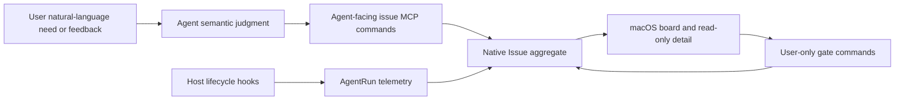

# Native Issue Board Design

## 1. Responsibility model



The Agent authors meaning. Hooks observe execution. The user approves or
rejects narrow state transitions. The board visualizes the result.

## 2. Aggregate and persistence

`native_issues` is the sole ongoing Issue source of truth:

```text
issue_id                 globally unique `issue_` + 32 lowercase hex identifier
project_id
issue_number             unique per Project, 1...999
title
description              Markdown, Agent-authored
acceptance_criteria_json JSON string array
external_references_json JSON array of typed Issue/PR URL references
status                   todo | in_progress | paused | in_review | done
verification_level       agent_self | human_required | mixed
verification_steps_json  human verification protocol (completed flags)
revision                 optimistic concurrency token
changed_by_run_id?       latest semantic Agent owner/proposer
closure_summary?
created_at / started_at? / updated_at / closed_at?
archived_at?
UNIQUE(project_id, issue_number)
```

Board-state transitions are recorded as an event timeline
(`from_state`, `to_state`, `changed_by_run_id`, `occurred_at`), so a card's
history shows which Agent moved it and when.

Dependencies and blocking predicates live in two Project-scoped child tables:

```text
issue_dependencies(project_id, issue_number, depends_on_number, created_at)
  issue_number       the dependent Issue
  depends_on_number  the prerequisite Issue, same Project, not the Issue itself
  PK (project_id, issue_number, depends_on_number)

issue_blocking_facts(project_id, issue_number, fact_id, kind, value?,
                     description, satisfied, created_at, updated_at)
  fact_id            stable predicate identifier, e.g. host:zed-hooks
  kind               host_capability | external
  value?             optional condition value, e.g. the capability name
  satisfied          whether the condition currently holds (block lifted)
  PK (project_id, issue_number, fact_id)
```

A blocking predicate is a checkable condition, not a free-form note: `kind`
selects a controlled vocabulary (host capabilities are detectable predicates;
`external` covers conditions without a daemon-side evaluator yet) and
`satisfied` records whether the condition currently holds. Unsatisfied facts
keep the Issue blocked until the Agent updates the fact.

Both child tables are updated only through the Issue update path, never by
AgentRun events. Dependencies are validated on write: keys must exist in the
same Project, must not repeat or self-reference, and the whole Project graph
must stay acyclic (Kahn topological sort). Deleting an Issue removes its
dependency edges in both directions and its blocking facts.

`agent_runs.issue_number` links execution to the aggregate. AgentRun lifecycle
events never mutate `native_issues.status`.

Identity has two intentionally different forms:

- `issue_id` is global and is the value copied from Kanban for Agent lookup;
- `ISSUE-NNN` is readable but only unique within `project_id`.

The timestamps describe the current Issue lifecycle:

- `created_at` is immutable;
- `started_at` is first written by `begin_work`, never by a hook;
- `closed_at` is written only by the user `approve_closure` gate;
- Request Changes preserves `started_at`; Reopen clears both `started_at` and
  `closed_at`, so the next semantic start begins a new cycle;
- the UI labels `started_at` as Opened and never derives a duration. Missing
  legacy timing stays unknown rather than being inferred from AgentRun telemetry.

`native_issue_imports(project_id, imported_at)` records one-time migration from
legacy Memory documents. Import copies data and legacy state; no resource id,
path, Draft id, commit id, or content hash is retained as a live relationship.

## 3. Commands

### Agent commands

`get_issue` resolves one globally unique `issue_id` and returns the owning
`project_id`, full description, acceptance criteria, verification protocol,
`changed_by_run_id`, state, revision, and event timeline. It is the lookup path
when a user pastes an ID copied from Kanban.

`create_issue` validates structured content, allocates the smallest available
number in `001...999` inside one transaction, and inserts Todo at revision 1.

`update_issue` requires the current revision and updates only supplied semantic
fields. It does not change status.

`dependencies` (on create and update) is a replace-whole-list field like
`external_references`: omission leaves the list unchanged, an explicit empty
list clears it. `blocking_facts` follows the same patch semantics.

An Issue is **blocked** while any dependency is not Done or any blocking fact
has `satisfied = false`. `blocked`, `blocking_reasons`, the resolved dependency
states, and the blocking facts are computed on read from the two child tables,
so closing a dependency automatically unblocks every Issue that depends on it
with no stored state to recompute. Blocking is orthogonal to `stale` and to
In Progress: a blocked Todo simply reports why it cannot start yet, and the
board/Agent decide whether to act.

`external_references_json` stores at most 16 `{kind, url}` objects. `kind` is
`issue` or `pull_request`; URL normalization accepts only absolute HTTP(S) URLs
with a host and no embedded credentials. De-duplication uses normalized URL plus
kind while preserving the first occurrence's order. Query strings and fragments
remain part of the reference.

`start_issue_work` (`kanban.begin_work`) validates the hook-issued run and the
open Issue, prevents run rebinding, enforces the session single-hold rule (one
session holds at most one In Progress Issue), links the run, and moves any
non-Done Issue to In Progress. The same run/state retry is idempotent.

`pause_issue_work` requires the run bound to an In Progress Issue and moves it
to Paused; the run stays running so it can resume later.

`resume_issue_work` requires Paused. The agent path requires the pausing run
(`changed_by_run_id`) or an explicit `takeover`; the human path omits the run,
refuses while another AgentRun is actively working the Issue, and unbinds stale
ended run bindings.

`unclaim_issue` releases a Paused or abandoned In Progress Issue back to Todo
without an AgentRun binding. It is refused while an active run works the Issue;
that run must pause or request closure first.

`request_issue_closure` requires a root run that owns the In Progress Issue and
no other unexpired active run. When `verification_level` is not
`agent_self`, `verification_steps` must be present. It records the bounded
proposal summary and transitions to In Review. Retries with identical inputs
are idempotent.

`export_issue` produces a deterministic, portable Markdown snapshot of the
Issue (title, description, acceptance criteria, references, dependencies,
blocking facts, verification protocol, state, and timeline).

### User gates

`apply_issue_gate` accepts one tagged action:

| Action | Required current state | Result |
|---|---|---|
| `approve_closure` | In Review | Done |
| `request_changes` | In Review | In Progress |
| `reopen` | Done | Todo |

Every gate requires `expected_revision`; mismatches and invalid transitions are
conflicts. Approval clears active ownership and sets `closed_at`. Request
Changes clears the closure proposal while retaining the current cycle start and
AgentRun history. Reopen clears closure data and the current cycle timing, and
does not invent an AgentRun owner.

The human Release/Resume paths reuse `unclaim_issue` and `resume_issue_work`
with no run, so a Paused or abandoned Issue can be handed back to Todo or back
to In Progress without an AgentRun binding.

`remove_issue` accepts user-only cleanup actions. Archive requires Done and
sets `archived_at`, which removes the Issue from project-scoped board/list
projections while preserving global lookup. Delete requires any non-Done state,
unlinks retained AgentRun telemetry, then removes the native Issue row. A Done
Issue must be archived rather than deleted.

## 4. Projection

The board loads native rows and AgentRuns, then computes:

```text
active_runs = linked runs whose phase/lease projects as running
latest_run  = newest linked run activity
is_stale    = status == in_progress
              && active_runs.is_empty
              && max(kanban.updated_at, latest_run.activity) <= now - 24h
blocked     = any dependency board_state != done
              || any blocking fact satisfied = false
blocking_reasons = unresolved dependency keys/states plus unsatisfied facts
```

Stale In Progress cards form the derived **Abandoned** column: the daemon never
stores an "abandoned" state, and the UI asks the human to verify what the
previous handler left behind before releasing it. The response includes a board
revision derived from the newest native Issue revision/update timestamp.
Details are loaded on demand and cached against the Issue revision.

## 5. MCP contract

```json
{"op":{"list":{}}}
{"op":{"get":{"issue_id":"issue_0123456789abcdef0123456789abcdef"}}}
{"op":{"create":{"title":"Export Issues as Markdown","description":"...","acceptance_criteria":["..."],"external_references":[{"kind":"issue","url":"https://github.com/org/repo/issues/7"}],"dependencies":["ISSUE-003"],"blocking_facts":[{"fact_id":"host:zed-hooks","kind":"host_capability","value":"hooks","description":"Zed lacks lifecycle hooks","satisfied":false}],"verification_level":"human_required","verification_steps":[{"text":"Run the manual release checklist"}]}}}
{"op":{"update":{"issue_key":"ISSUE-007","expected_revision":1,"external_references":[{"kind":"pull_request","url":"https://github.com/org/repo/pull/42"}],"blocking_facts":[]}}}
{"op":{"begin_work":{"run_id":"arun_...","issue_key":"ISSUE-007","expected_revision":4}}}
{"op":{"pause_issue":{"run_id":"arun_...","issue_key":"ISSUE-007"}}}
{"op":{"resume_issue":{"run_id":"arun_...","issue_key":"ISSUE-007","takeover":true}}}
{"op":{"unclaim":{"issue_key":"ISSUE-007","expected_revision":5}}}
{"op":{"request_closure":{"run_id":"arun_...","summary":"Criteria satisfied","expected_revision":5}}}
{"op":{"export":{"issue_key":"ISSUE-007"}}}
```

There is no MCP approval operation and no generic status setter.

## 6. Hook protocol

UserPromptSubmit records/upserts the root AgentRun and injects its exact identity
plus instructions to choose existing/new/no Issue. The instruction names
`kanban.create`; it never tells the Agent to create a Memory document.

Before root Stop, the host-specific hook reminds the Agent to request closure
only after a semantic acceptance-criteria check. Normal Stop ends telemetry
without an outcome-based Issue transition. Subagent Stop records telemetry only.

Codex and Claude Code use managed shell Hooks; opencode uses its plugin API;
the DeepSeek Harness (dsh) forwards the same lifecycle vocabulary through
`clumsiesd _agent issue-run-event --host dsh`. StopFailure records a failed
outcome; SessionEnd ends remaining runs for the session.

## 7. macOS composition

The sidebar presents this workspace as `Kanban`; Issue remains the entity and
MCP name. Kanban uses `NavigationSplitView(GlobalSidebar, NavigationStack)`.
The board is the stack root and Issue detail is a native destination pushed in
the detail column. This keeps the global sidebar visible, delegates toolbar and
full-screen safe-area behavior to the system, and supplies the standard Back
affordance without a custom overlay, inspector, or floating panel.

The board shows five columns — Todo, In Progress, In Review, Abandoned
(derived), Done. `IssueBoardRoute` carries only the globally unique native
Issue ID. The detail resolves the current card from the board model and renders
the title, Markdown description, verification section (titled by verification
level), and event timeline in a readable-width document layout. It does not
display editing controls, a custom surface, or a Memory document link.

Cards keep the compact lifecycle times meaningful to their state: Created for
Todo, Opened for active work (In Progress, Paused, In Review), and Opened plus
Closed for Done. Cards show a description excerpt and a handler status chip for
the active/pausing AgentRun. All user actions live in the card context menu:
global ID copy, Pause/Resume/Take Over/Release, state gates, archive, and
delete. When external references exist, the card adds compact per-kind
summaries rather than rendering raw long URLs. Its context menu supplies Open
and Copy Link commands. Issue and Pull Request presence are orthogonal board
filters and may be combined with Project, Stale, and blocked filtering.

Single-clicking a card only changes the board selection. Double-clicking it, or
choosing View Details from its context menu, pushes the detail destination.
Returning pops back to the existing board root, preserving its view state.
Project changes clear the navigation path. Board polling preserves the last
successful response and rejects late cross-project results.

## 8. Upgrade

Local schema 23 to 24 adds `native_issues` and `native_issue_imports`. Local
schema 24 to 25 adds nullable `native_issues.started_at` without synthesizing
values for existing rows. Local schema 25 to 26 removes unused type, priority,
and components columns and adds nullable `archived_at`. Local schema 26 to 27
adds `external_references_json`. Local schema 27 to 28 expands AgentRun hosts
with `zed` and `manual` (manual run binding). Local schema 28 to 29 adds
`issue_dependencies` and `issue_blocking_facts` (Issue dependency and blocking
predicate support). The first board access per Project may parse legacy Memory
Issue files once and insert copies using their numbers and last known board
states. The import marker is written in the same transaction, including when no
legacy Issues exist.

Later migrations (through the current version 37) add `verification_level` /
`verification_steps` (31→32), widen the status CHECK with `paused` (32→33),
rename `closure_requested` to `in_review` (33→34), expand AgentRun hosts with
`dsh` (35→36), and widen local Draft kinds for the unified Memory model
(36→37).

After the marker exists, list/detail/start/update/closure/gate paths never load
Effective Memory for Issue behavior.
