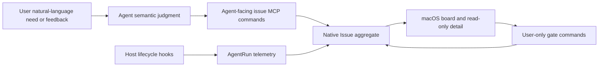

# Native Issue Board Design

## 1. Responsibility model



The Agent authors meaning. Hooks observe execution. The user approves or
rejects narrow state transitions. The board visualizes the result.

## 2. Aggregate and persistence

`native_issues` is the sole ongoing Issue source of truth:

```text
issue_id                 globally unique `issue_` + 32 lowercase hex identifier
project_id
issue_number             unique per Project, 1...999
title
description              Markdown, Agent-authored
acceptance_criteria_json JSON string array
external_references_json JSON array of typed Issue/PR URL references
status                   todo | in_progress | closure_requested | done
revision                 optimistic concurrency token
changed_by_run_id?       latest semantic Agent owner/proposer
closure_summary?
created_at / started_at? / updated_at / closed_at?
archived_at?
UNIQUE(project_id, issue_number)
```

`agent_runs.issue_number` links execution to the aggregate. AgentRun lifecycle
events never mutate `native_issues.status`.

Identity has two intentionally different forms:

- `issue_id` is global and is the value copied from Kanban for Agent lookup;
- `ISSUE-NNN` is readable but only unique within `project_id`.

The timestamps describe the current Issue lifecycle:

- `created_at` is immutable;
- `started_at` is first written by `start_issue_work`, never by a hook;
- `closed_at` is written only by the user `approve_closure` gate;
- Request Changes preserves `started_at`; Reopen clears both `started_at` and
  `closed_at`, so the next semantic start begins a new cycle;
- the UI labels `started_at` as Opened and never derives a duration. Missing
  legacy timing stays unknown rather than being inferred from AgentRun telemetry.

`native_issue_imports(project_id, imported_at)` records one-time migration from
legacy Context documents. Import copies data and legacy state; no resource id,
path, Draft id, commit id, or content hash is retained as a live relationship.

## 3. Commands

### Agent commands

`get_issue` resolves one globally unique `issue_id` and returns the owning
`project_id`, full description, acceptance criteria, state, and revision. It is
the lookup path when a user pastes an ID copied from Kanban.

`create_issue` validates structured content, allocates the smallest available
number in `001...999` inside one transaction, and inserts Todo at revision 1.

`update_issue` requires the current revision and updates only supplied semantic
fields. It does not change status.

`external_references_json` stores at most 16 `{kind, url}` objects. `kind` is
`issue` or `pull_request`; URL normalization accepts only absolute HTTP(S) URLs
with a host and no embedded credentials. De-duplication uses normalized URL plus
kind while preserving the first occurrence's order. Query strings and fragments
remain part of the reference.

`start_issue_work` validates the run and open Issue, prevents run rebinding,
links the run, and transitions Todo/Closure Requested/In Progress to In
Progress. The same run/state retry is idempotent.

`request_issue_closure` requires a root run that owns the In Progress Issue and
no other unexpired active run. It records the bounded proposal summary and
transitions to Closure Requested. Retries with identical inputs are idempotent.

### User gates

`apply_issue_gate` accepts one tagged action:

| Action | Required current state | Result |
|---|---|---|
| `approve_closure` | Closure Requested | Done |
| `request_changes` | Closure Requested | In Progress |
| `reopen` | Done | Todo |

Every gate requires `expected_revision`; mismatches and invalid transitions are
conflicts. Approval clears active ownership and sets `closed_at`. Request
Changes clears the closure proposal while retaining the current cycle start and
AgentRun history. Reopen clears closure data and the current cycle timing, and
does not invent an AgentRun owner.

`remove_issue` accepts user-only cleanup actions. Archive requires Done and
sets `archived_at`, which removes the Issue from project-scoped board/list
projections while preserving global lookup. Delete requires any non-Done state,
unlinks retained AgentRun telemetry, then removes the native Issue row. A Done
Issue must be archived rather than deleted.

## 4. Projection

The board loads native rows and AgentRuns, then computes:

```text
active_runs = linked runs whose phase/lease projects as running
latest_run  = newest linked run activity
is_stale    = status == in_progress
              && active_runs.is_empty
              && max(kanban.updated_at, latest_run.activity) <= now - 24h
```

The response includes a board revision derived from the newest native Issue
revision/update timestamp. Details are loaded on demand and cached against the
Issue revision.

## 5. MCP contract

```json
{"op":{"list":{}}}
{"op":{"get":{"issue_id":"issue_0123456789abcdef0123456789abcdef"}}}
{"op":{"create":{"title":"Export Issues as Markdown","description":"...","acceptance_criteria":["..."],"external_references":[{"kind":"issue","url":"https://github.com/org/repo/issues/7"}]}}}
{"op":{"update":{"issue_key":"ISSUE-007","expected_revision":1,"external_references":[{"kind":"pull_request","url":"https://github.com/org/repo/pull/42"}]}}}
{"op":{"start":{"run_id":"arun_...","issue_key":"ISSUE-007","expected_revision":4}}}
{"op":{"request_closure":{"run_id":"arun_...","summary":"Criteria satisfied","expected_revision":5}}}
```

There is no MCP approval operation and no generic status setter.

## 6. Hook protocol

UserPromptSubmit records/upserts the root AgentRun and injects its exact identity
plus instructions to choose existing/new/no Issue. The instruction names
`kanban.create`; it never tells the Agent to create a Context document.

Before root Stop, the host-specific hook reminds the Agent to request closure
only after a semantic acceptance-criteria check. Normal Stop ends telemetry
without an outcome-based Issue transition. Subagent Stop records telemetry only.

Codex and Claude Code are the implemented lifecycle-hook adapters.

## 7. macOS composition

The sidebar presents this workspace as `Kanban`; Issue remains the entity and
MCP name. Kanban uses `NavigationSplitView(GlobalSidebar, NavigationStack)`.
The board is the stack root and Issue detail is a native destination pushed in
the detail column. This keeps the global sidebar visible, delegates toolbar and
full-screen safe-area behavior to the system, and supplies the standard Back
affordance without a custom overlay, inspector, or floating panel.

`IssueBoardRoute` carries only the globally unique native Issue ID. The detail
resolves the current card from the board model and renders only the title and
Markdown description in a readable-width document layout. It does not display
metadata, acceptance criteria, editing controls, a custom surface, or a Context
document link.

Cards keep the compact lifecycle times meaningful to their state: Created for
Todo, Opened for active work, and Opened plus Closed for Done. All user actions
live in the card context menu: global ID copy, state gates, archive, and delete.
When external references exist, the card adds compact per-kind summaries rather
than rendering raw long URLs. Its context menu supplies Open and Copy Link
commands. Issue and Pull Request presence are orthogonal board filters and may
be combined with Project and Stale filtering.

Single-clicking a card only changes the board selection. Double-clicking it, or
choosing View Details from its context menu, pushes the detail destination.
Returning pops back to the existing board root, preserving its view state.
Project changes clear the navigation path. Board polling preserves the last
successful response and rejects late cross-project results.

## 8. Upgrade

Local schema 23 to 24 adds `native_issues` and `native_issue_imports`. Local
schema 24 to 25 adds nullable `native_issues.started_at` without synthesizing
values for existing rows. Local schema 25 to 26 removes unused type, priority,
and components columns and adds nullable `archived_at`. The first
board access per Project may parse legacy Context Issue files once and insert
copies using their numbers and last known board states. The import marker is
written in the same transaction, including when no legacy Issues exist.

After the marker exists, list/detail/start/update/closure/gate paths never load
Effective Memory for Issue behavior.
