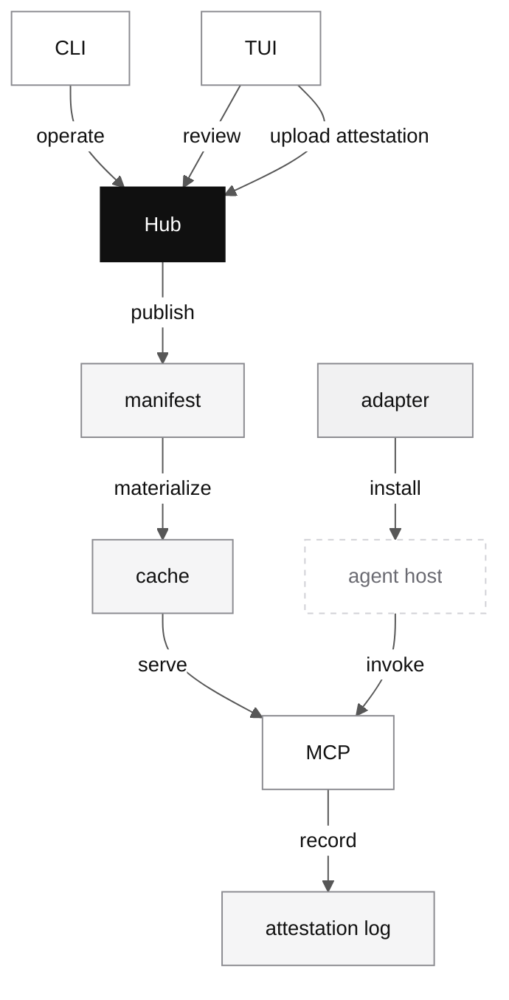

# Runtime surfaces

## Why this page exists

The object model explains what clumsies stores. It does not explain how the system actually runs on a machine. This page covers that second question: what local state exists, how it gets there, and which runtime surfaces read it.

The shortest version is:

- Hub is authoritative
- sync produces a local workspace snapshot
- MCP serves that local snapshot to agents
- adapters wire real hosts into the right runtime path
- CLI and TUI operate on the same authority model

The TUI matters here because it is the clearest human-facing proof that runtime is not just a pile of local files. It uses the same Hub and local-state model to drive browsing, review, and analysis screens that the CLI alone cannot present well.

## The runtime stack



That stack deliberately separates authority from execution. Hub owns meaning. The local machine owns fast runtime reads and host-specific integration.

## A concrete end-to-end runtime path

A realistic local path looks like this:

1. a user logs in and binds one or more local paths to a workspace
2. `clumsies sync` fetches the workspace manifest from Hub
3. the client writes `manifest.json` to the bound workspace runtime directory
4. the client compares manifest entries against local cache files and fetches only changed content
5. an adapter installs host-specific runtime surfaces such as config, hooks, and scripts
6. the host starts `clumsies mcp serve`
7. the agent uses the MCP tool surface against local runtime state
8. runtime events are buffered locally and later uploaded as attestation data

The page is long because every one of those steps leaves machine state behind. If the docs skip that, users have nowhere to look when runtime behavior feels wrong.

## Local runtime root

The current runtime root is:

```text
~/.clumsies/
```

This directory is not one generic cache. It contains several different state types with different lifetimes and safety expectations.

| Path | Purpose |
| --- | --- |
| `~/.clumsies/config.toml` | local server config and workspace bindings |
| `~/.clumsies/auth.json` | auth token file fallback |
| `~/.clumsies/workspaces/{workspace_name}/manifest.json` | last synced workspace snapshot |
| `~/.clumsies/workspaces/{workspace_name}/cache/` | materialized rules, context, and meta prompt |
| `~/.clumsies/adapters/installs/{install_id}/` | adapter install state and removal history |

Auth uses the credential store selected by `CLUMSIES_AUTH_STORE`. The default
store is `file`, which writes `~/.clumsies/auth.json`. macOS Keychain remains
available through `CLUMSIES_AUTH_STORE=keychain` or `auto`, but it is not the
default because repeated system password prompts are too disruptive for normal
TUI startup and local development.

## `config.toml`: local bindings and server target

The runtime uses `~/.clumsies/config.toml` to answer two questions:

1. which Hub should this machine talk to
2. which local paths are bound to which workspaces

The current file stores at least:

| Field | Meaning |
| --- | --- |
| `server.url` | Hub base URL |
| `[[workspaces]].name` | local workspace label |
| `[[workspaces]].ws_id` | authoritative workspace ID |
| `[[workspaces]].paths` | local filesystem paths bound to that workspace |

This means the local checkout path is not the workspace identity. It is a client-side binding to a server-side project boundary.

## `manifest.json`: the workspace snapshot

After sync, the current workspace snapshot is written to:

```text
~/.clumsies/workspaces/{workspace_name}/manifest.json
```

This file is the serialized `WorkspaceManifestResponse` from Hub. It is not just a timestamp or sync marker. It is the indexed description of what the workspace currently exposes to local runtime.

A simplified example looks like this:

```json
{
  "ws_id": "ws-1",
  "name": "demo",
  "revision": 7,
  "rules": {
    "p-1": {
      "path": "rule/coding/00_COMPATIBILITY.md",
      "hash": "sha256:def",
      "description": ""
    }
  },
  "context": {
    "ctx-1": {
      "path": "spec/ARCHITECTURE.md",
      "hash": "sha256:abc",
      "description": ""
    }
  }
}
```

The top-level fields are doing real work.

| Field | Why it matters |
| --- | --- |
| `ws_id` | stable workspace identity |
| `name` | display label for humans and tooling |
| `revision` | monotonic snapshot version used by sync logic |
| `rules` | Artifact-backed runtime behavior selected by the workspace |
| `context` | workspace-owned runtime knowledge |

The map entries also matter.

| Entry field | Why it matters |
| --- | --- |
| `path` | target runtime path under cache |
| `hash` | refetch decision input |
| `description` | optional schema-carried text |

Two schema details are worth calling out.

First, `rules` and `context` are stable-ID keyed object maps, not arrays. That lets a rename preserve identity. The runtime can understand that the thing moved rather than pretending a delete-plus-create happened.

Second, `manifest.json` lives alongside `cache/`, not inside it. The manifest describes the snapshot. The cache materializes the content addressed by that snapshot.

## `cache/`: the materialized runtime tree

The actual synced content lives under:

```text
~/.clumsies/workspaces/{workspace_name}/cache/
```

The current implementation writes at least these categories there:

| Path under cache | Meaning |
| --- | --- |
| `rule/` | synced Artifact behavior content |
| `context/` | synced workspace context files |
| `META_PROMPT.md` | meta-prompt used by agent bootstrap |

This explains several behaviors that would otherwise look arbitrary.

`clumsies sync` can skip unchanged content because it compares manifest entries to the files already present in cache. MCP can serve quickly because it reads local files from cache rather than re-fetching from Hub for every tool call. Agent bootstrap can be deterministic because `META_PROMPT.md` comes from the workspace cache path, not from a random repo file somebody happened to create.

`META_PROMPT.md` also deserves to be read as a first-class runtime artifact. It is the bootstrap frame that tells the agent to discover constraints through `memdisc`, load them through `memload`, and declare actual usage through `memref`. The full current workspace copy is documented on the dedicated [META_PROMPT](/meta-prompt) page because it is stable enough to matter, but specific enough that it should not be duplicated across every runtime section.

## How sync actually uses manifest and cache

The current sync shape is:

1. fetch the workspace manifest from Hub
2. write `manifest.json`
3. compare each manifest entry's `path` and `hash` against local files
4. fetch only changed rule or context content
5. refresh the cache tree under the workspace directory

That means stale runtime behavior is often a state problem before it is an architecture problem. If something looks wrong, inspect the local manifest and cache before assuming Hub or MCP is broken.

## MCP: the agent-facing runtime surface

MCP is the runtime surface agents actually talk to. Its job is to expose workspace material to the host in a structured way and to record the usage path.

The current runtime path looks like this:

1. bootstrap the session
2. discover the available items
3. load the items needed for the current task
4. refer to the constraints actually applied
5. submit or reject the turn result

The current implementation exposes the memory runtime tool surface:

- `memsetup`
- `memdisc`
- `memload`
- `memref`
- `agentreport`
- `agentrejected`

That distinction is exactly the sort of detail users need when reading docs and code side by side.

## Adapter: host integration state

Adapter is the layer that makes host runtime real. MCP by itself does not configure Codex, Claude Code, or another host. Something still has to write config, register hooks, install scripts, and keep remove safe.

The current install state lives under:

```text
~/.clumsies/adapters/installs/{install_id}/
```

That directory contains at least:

| Path | Purpose |
| --- | --- |
| `manifest.json` | current managed state for that install |
| `wal.jsonl` | install, update, and remove history |

Those two files serve different jobs. `manifest.json` describes the active managed state. `wal.jsonl` records the history that explains how the install reached that state. Removal logic depends on this distinction. The tool should know what it owns and what it changed rather than blindly deleting host files.

For Codex specifically, the important runtime surfaces are:

- `.codex/config.toml`
- `.codex/hooks.json`
- `.codex/hooks/*.sh`
- optional repo-local skills

## TUI as a runtime surface

TUI is part of runtime, not a side note. It is worth saying explicitly because the code already treats it as a serious client.

The current TUI reads from both Hub-backed APIs and selected local runtime files:

| Runtime input | Why TUI uses it |
| --- | --- |
| Hub APIs | workspace state, Artifact state, PR detail, stats, membership |
| local attestation reader | recent inputs and dashboard state |
| local drafts and editor host state | editing and review flows |

The current repo also ships working captures of two real TUI screens:


Those images are not decoration. They show the product value of a persistent runtime surface: split-pane browsing, dense state review, and trend-heavy analysis that would be awkward as one-shot commands.

If you want the screen-by-screen breakdown, continue to [TUI](/tui).

That is why adapter belongs in architecture and runtime docs, not just in a setup guide.

## Auth state

Auth is another place where local runtime details matter. The current
implementation supports file, Keychain, auto, and memory-backed credential
stores. The default file store is intentionally low-friction; stricter
deployments can opt into Keychain.

That means auth problems can be machine-specific even when the server is fine.
If one machine behaves differently from another, the first question is often
whether both are using the same auth store and Hub URL.

## Attestation buffering

Runtime evidence is intentionally not written through to Hub on every action. The local runtime buffers events and uploads later.

That gives the system two useful properties:

- runtime stays responsive during normal agent work
- Hub still receives durable evidence for later analysis

The current codebase is still in a terminology transition from trace to
attestation. The runtime idea is unchanged: discover, load, refer, and
related session signals leave evidence.

## Where to inspect when something feels wrong

The current runtime leaves enough local state behind that filesystem inspection is often the fastest debug move.

| Symptom | First place to inspect |
| --- | --- |
| workspace content looks stale | `~/.clumsies/workspaces/{workspace_name}/manifest.json` and `cache/` |
| agent bootstrap does not match workspace state | cached `META_PROMPT.md` |
| adapter remove or update behaves unexpectedly | install `manifest.json` and `wal.jsonl` |
| auth differs between machines | `CLUMSIES_AUTH_STORE`, `auth.json`, or Keychain state |
| agent runtime sees a different workspace than expected | `config.toml` bindings |

## One implementation gap worth calling out

There is still a gap between the clean long-term model and the current local MCP implementation. Discovery already exposes context items, but the load path still reflects earlier prompt-loading assumptions more directly than a fully unified rule-and-context model would.

That is not a reason to soften the docs. It is a reason to separate three things cleanly whenever they differ:

- stable product boundary
- current implementation
- target architecture
