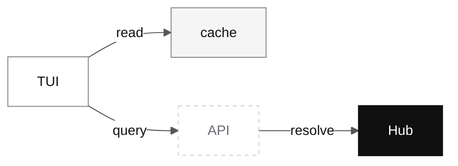

# TUI

## What the TUI is

The TUI is clumsies' terminal dashboard. It is the human-facing visual client for the system, not a separate backend and not a decorative wrapper around the CLI.

Its job is to give operators a denser view of the system than one-shot commands can provide. In practice that means library browsing, workspace status, review flows, and operational analysis in one terminal-native interface.

## Current screenshots

The current repo already has working TUI captures. They are useful because they show the product as it exists now, not as a future wireframe.

The library view shows the browsing side of the product: list density, selection rhythm, and the kind of terminal-native reading flow the CLI does not handle well.

The analysis view shows why the TUI matters as its own surface. This is the kind of status-heavy, comparison-heavy screen that benefits from a persistent layout rather than a sequence of one-shot commands.

## Why the TUI exists

CLI is good at discrete actions: login, init, sync, adapter install, flush. It is not good at sustained observation, comparison, or review-heavy work.

The TUI exists because the product needs a place where a human can keep state in view and move through it without constantly reissuing commands. That is especially important for:

- library browsing
- workspace status inspection
- PR review
- insights and usage analysis

This is why the TUI should be documented as a real client surface rather than treated as an implementation detail under the CLI.

## What the code already proves

The value of the TUI is not hypothetical. The current source tree already has dedicated modules for:

- dashboard
- library browsing
- rule detail and PR detail
- workspace status
- analysis
- settings
- attestation reading
- drafts and session readers
- diff viewer, modal, chart, split-pane, and input widgets

That matters because it shows the TUI is already a serious Hub client, not a thin terminal wrapper around a few CLI commands.

## Where it sits in the system

Like the CLI, the TUI is a client of Hub. It reads server-backed state through the same authority model and uses local state where that improves responsiveness. It does not introduce a second truth source.

## What the TUI wants to show

The dashboard spec describes the TUI as the place for several high-value operator views:

| Area | What it is for |
| --- | --- |
| Library | browse shared rules, workflows, bundle composition, and usage distribution |
| Rule detail | inspect usage, history, and related review flow |
| Workspace status | see sync state, local draft state, and project-level composition |
| Insights | analyze usage and activity patterns |

The exact screen organization is still evolving, but the product role is already clear: this is the densest human control surface in the system.

## Concrete screen details in the current implementation

The current code already exposes a lot of product intent that is worth documenting.

### Dashboard

The dashboard screen combines a trend chart with a live input feed.

Current details from `src/client/tui/app/dashboard.zig` include:

- chart title: `Signal Trend`
- scope switching hint: `w scope`
- attestation flush hint: `Shift-F flush`
- live session count shown in the header when available
- lower panel title shape: `Recent Inputs · <scope> · live feed`
- input detail overlay for reading captured user input in full

That tells you what the dashboard is trying to be: not a static summary page, but an operational screen for current signal and recent activity.

### Library

The Library screen is a true split-pane browser, not a single scrolling list.

Current behavior in `src/client/tui/app/library.zig` includes:

- left list panel plus right detail panel
- tab split between `Files` and `Pull Requests`
- bundle filter on `b`
- refresh on `r`
- new draft on `n`
- tab switching on `[` and `]`
- focus shift into detail on `Tab`
- PR filter cycling on `f`
- a separate cursor gutter so list text stays clean

That is why the screenshot matters. It is showing a specific interaction model, not a generic terminal aesthetic.

### Workspace

The workspace screen is not just another Library variant. It has its own status and creation flow.

The current code already includes:

- workspace status layout with top workspace bar
- lower split panes
- tabs for `context` and `rules`
- create-workspace modal flow
- row-level draft status markers
- virtual rows for create-operation drafts

### Analysis

The analysis screen is where Hub stats become operator-readable.

The current code renders:

- rule ranking metrics such as `reach`, `trend`, and `last`
- member and rule detail drill-down
- a remote-analysis availability message when Hub stats have not loaded yet

This is exactly why Hub interface detail and TUI detail belong together in the docs. The stats endpoints are not abstract. They drive a real operator surface.

## TUI and review work

One of the strongest reasons for a TUI layer is review. Rule review, context review, and status-heavy operational flows are all more comfortable when the user can keep a list, a detail panel, and a diff-oriented reading flow on screen at the same time.

That is why the TUI matters even if the CLI remains the main operational entrypoint for single commands.

## TUI and the all-Zig stack

The current architectural intent is to keep the TUI inside the same Zig-centered stack rather than introducing a separate web frontend just to get a richer operator UI.

That matters for two reasons:

- it keeps the product technically coherent
- it forces the TUI to be treated as a first-class client, not as a temporary stopgap before "the real UI"

## What to read next

If you are reading from the product side, go back to [Runtime surfaces](/runtime). If you are reading from the implementation side, continue to [Codebase map](/repos) and then inspect `src/client/tui/`.
