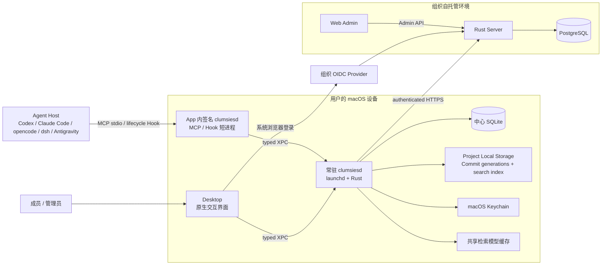
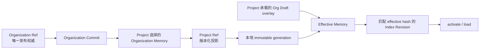
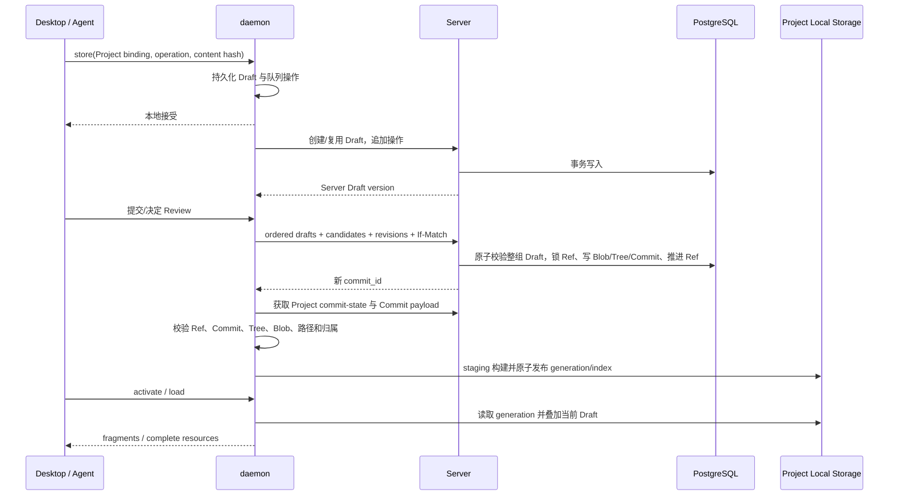

# 系统架构

本文是 clumsies **当前系统架构的唯一总纲**，描述已经落入现行代码的边界、
数据所有权、运行路径、安全约束与关键决策。迁移过程和退役实现不在这里维护；
组件级细节由本文链接的专题文档展开，不能反向改变本文定义的系统边界。

## 1. 系统上下文

### 目标

clumsies 为编码 Agent 提供持久、可检索、可审查的外部记忆。系统需要同时满足：

- 组织共享内容有唯一权威版本，不能由某台开发机或某个 Agent 会话私自发布；
- Agent 在当前 Project 中读取“已发布内容 + 本地未合并 Draft”的一致视图；
- Desktop 关闭后，本地 Draft、同步、检索和 Agent 接入仍能继续工作；
- 写入先可靠落地，再异步同步；失败必须可见、可重试，不能静默丢失；
- 本地凭据、工作目录和 Agent 活动保持在明确的信任边界内；
- Review、Issue 和检索诊断可追溯，但不把临时执行状态伪装成内容权威。

系统不以替代 Git、通用聊天记录、云端 Agent 执行平台或任意文件同步工具为目标。
MCP 也不是发布接口：Agent 只能创建 Project 承载的提案 Draft，不能自行批准或合并。

### 系统边界



### 外部参与者与约束

| 参与者 | 能做什么 | 不能做什么 |
| --- | --- | --- |
| 普通成员 | 浏览 Memory，编辑 Draft，提交 Review，使用 Project 与 Agent | 直接推进组织权威 Ref，批准自己的发布 |
| 组织 owner/admin | 管理组织并决定 Organization Memory 的发布 Review | 绕过 Commit/Ref 并发约束直接改表 |
| Agent Host | 通过 `memory` 和 `kanban` 使用绑定 Project | 选择任意 Project、读取凭据、批准 Review 或关闭自己的 Issue |
| OIDC Provider | 证明组织成员身份 | 持有 clumsies 的本地 Project 状态 |

### 当前实现边界

当前已实现：Organization 唯一 Memory 权威、Project 选择与投影、本地 Draft 队列、
支持有序多 Draft 的 Review/Commit 原子发布、常驻 daemon、macOS XPC、Codex、
Claude Code、opencode、dsh 与 Antigravity 接入、Effective Memory overlay、混合检索、
检索历史与 Evaluation Case、Server 共享 Kanban Issue/lease claim 与本地 AgentRun
投影、OIDC 登录和 Keychain 凭据存储。Memory 在 Server、daemon 与 MCP 的主要读写模型
已经统一，但下列兼容字段仍说明迁移没有完全收口。

以下能力尚未实现或不属于当前承诺：

- Windows 服务管理和 IPC 传输；当前本地运行边界仅支持 macOS launchd + XPC；
- 自动替用户解决三方合并冲突；系统能生成规范候选并显式 rebase，冲突结果仍需确认；
- 生产级、经人工标注并版本化的代表性检索查询集；现有诊断和评测机制已经可用；
- 增量 Commit 对象传输；Server 当前发布完整 Commit payload；
- `description` 的非空约束尚未贯穿全部 Draft 写入与 merge 路径，当前数据仍可能为空；
- macOS 仍保留 `MemoryKind` 驱动的交互，OpenAPI/Commit TreeEntry 仍接受历史
  Context、Rule、Workflow 枚举；它们是待删除的兼容层，不是现行领域分类；
- `/api/v1/projects/{project_id}/memories` 仍是 legacy Project-scope 清理读取面，
  不是 Project 投影 API；
- Activity 的正常 App 列表从 Project binding 枚举 workspace，完整历史片段读取也校验
  binding；但底层 `ListRecallsRequest.workspace_root` 当前只规范化显式路径、尚未强制
  验证其已绑定，本机 XPC 调用方可因此读取未绑定目录的 DSH/Codex 投影；
- 通用 CLI、Zig TUI 和旧 attestation 客户端；这些都不在现行运行边界内。

## 2. 总体架构

### 组件职责

| 组件 | 负责 | 不负责 |
| --- | --- | --- |
| Server | 组织与 Project 身份、授权、Organization Memory、Project 选择/投影、Draft/Review、Commit 图、共享 Kanban Issue 与 lease claim、审计 | 本地工作目录、检索模型、客户端进程生命周期 |
| PostgreSQL | Server 权威数据与事务约束 | 本地 Draft 可用性和 Project 搜索索引 |
| 常驻 daemon | Project 绑定、本地 Draft、同步队列、Commit 缓存与安装、Effective Memory、检索、AgentRun、Issue 本地副本与 stale 投影、本地 Server 代理 | 发布审批、Organization Memory 权威和共享 Issue/claim 权威 |
| Project Local Storage | 可重建的 immutable generations 与 Project 搜索数据库 | Draft、凭据、共享模型和 Server 权威 |
| Desktop | Memory、Draft、Review、Issue、诊断和设置的原生交互 | bearer token 和内容权威 |
| Agent runtime proxy | 有界 MCP/Hook 解码、运行身份校验、Project 解析和 typed XPC 转发 | 数据库、模型、后台 worker 和第二套检索实现 |
| Web Admin | 组织、成员、Project、令牌、审计和健康管理 | 日常 Memory 编辑和 Review 工作流 |

Desktop 与 daemon 同时存在是有意的：Desktop 负责用户交互，daemon 负责不依赖窗口
生命周期的持久状态和后台工作。Desktop 关闭时，已持久化 Draft 仍可同步，Agent 仍可
通过 App 内同一份签名的 `clumsiesd` 访问常驻进程。

### 权威与投影



Organization Ref 是唯一可发布的 Memory 权威指针。Project Ref 只标识该 Project
当前选择内容的版本化物化结果，不是第二个发布命名空间。Project 承载的
Organization Draft 在合并前只影响该 Project 的 Effective Memory；批准并合并后，
Server 才创建新的 Organization Commit 并推进 Organization Ref。

### 跨组件不变量

- Server 决定身份、授权和发布；daemon 决定本机持久化、同步和派生读取状态。
- `store` 成功只表示本地操作已持久化，不表示已经同步或发布。
- 纳管的 host-plugin 必须从当前目录解析 canonical `project_id`；Desktop 当前选择项不能
  重定向它，请求体也不能改写 Project。
- 手工启动的普通 `mcp serve` 保留兼容回退：目录没有绑定时可以使用 daemon 当前选中的
  Project；该回退不适用于纳管 host-plugin，也不允许调用方指定任意 Project。
- Kanban Issue 与 lease claim 以 Server 记录协调多安装并发；daemon 不能只凭本地副本授予 claim。
- Ref、Draft、Issue 和 AgentRun 都使用乐观并发或明确的所有权约束，拒绝隐式覆盖。
- 派生缓存可以删除并重建；Draft、操作队列、凭据和权威历史不能因此丢失。

## 3. 数据架构

### 核心领域对象

| 对象 | 含义与身份 |
| --- | --- |
| Memory | 唯一的一等内容对象；拥有稳定 opaque ID、权威 `name`、可变路径、从 Markdown/路径派生的展示标题、语义 `description`、Markdown 正文、revision 与状态；目标约束要求 description 非空，但当前写入链尚未完全强制 |
| Organization | 唯一 active Memory 权威作用域，拥有 Organization Ref 与不可变 Commit 历史 |
| Project | 仓库绑定、授权边界、Organization Memory 选择、Project Ref 和合并前 Draft overlay 的承载者 |
| Blob / Tree / Commit / Ref | 内容寻址正文、某版本资源集合、不可变版本及可移动头指针 |
| Draft | 基于明确 `base_commit_id` 的有序 create/update/rename/delete/discard 操作；生命周期与 freshness、reconciliation 分开 |
| Review | 人类协调和发布决策边界；持有有序且非空的 Draft 集合，逐 Draft 计算 freshness/reconciliation，并原子提交、决定和合并 |
| Bundle | 某成员保存的共享 Memory ID 集合，不创建内容副本或新权威 |
| Effective Memory | 已安装 Project 投影与当前 open/submitted Draft 操作合成的本地读取模型 |
| Issue / lease claim | Server 中的共享 Kanban 权威记录；daemon 保存本地副本供原生交互，并与本机 AgentRun、lease 和 stale 状态合成看板投影 |
| AgentRun | daemon 本地的有界执行遥测，可绑定 Issue，但生命周期事件不直接决定 Issue 语义状态 |
| Retrieval Run / Evaluation Case | 本地检索轨迹及其人工标注评测样本，不上传 Server |

Memory 的目标角色——规则、流程、项目背景或设计约束——由内容和路径表达，不由封闭的
Context / Rule / Workflow 类型决定。Server、daemon 检索和 MCP 已按统一 Memory 处理，
但 macOS `MemoryKind` 与 OpenAPI/Commit TreeEntry 的旧枚举仍是实现缺口。历史 `ctx_`、
`rul_`、`wfl_` ID 保持稳定；新对象使用 `mem_` 前缀。路径可重命名，不能替代稳定 ID。

Project 的 Effective Memory 来源是 Project 选择对应的 Commit/Ref 物化结果与 Draft
overlay。现有 `/api/v1/projects/{project_id}/memories` 只读取 legacy Project-scope
资源，用于迁移和清理兼容，不能作为 Project 投影或 Agent 读取路径。

### 版本与 Draft 一致性

```text
Blob -> Tree -> Commit -> Ref
                    ^
             Draft(base_commit_id + ordered operations)
```

Draft 的 Base、操作和正文不会因为远端 Ref 前进而自动变化。Server 或 daemon 可以把它
标为 `behind`，并生成绑定 Draft revision、Base Commit 和 Current Commit 的规范候选；
只有显式确认 rebase 才会保存旧 revision、推进 Base，并以相对 Current 的操作替换原操作。

一个 Review 可以按固定顺序包含多个 Draft。每个 Draft 独立携带 Base、version、
freshness 和 reconciliation；创建或重新提交 Review 时，Server 在同一事务内校验整组
Draft 并应用各自确认过的候选。合并同样锁定目标 Ref，校验 Review、全部 Draft Base、
版本和 `If-Match`，再一次性写入结果 Commit 并推进 Ref。任何一项过期都会拒绝整次发布，
不会留下部分 Draft 已合并的状态。Project 选择变化或 Organization 权威变化会重建受影响
的 Project 投影，但不会修改仍以旧 Base 为根的 Draft。

### 本地数据分层

| 数据 | 存储位置 | 性质 |
| --- | --- | --- |
| 组织、成员、Memory、Draft/Review、Commit 图、Kanban Issue/lease claim、审计 | PostgreSQL | Server 共享权威 |
| Project 绑定、Draft 与操作队列、缓存对象、Refs、Issue 本地副本、AgentRun、检索历史 | daemon 中心 SQLite | 本机持久状态与共享数据副本 |
| Commit generations、完整 Effective Memory、检索单元、FTS、向量 | Project Local Storage | 可验证、可重建的派生状态 |
| access/refresh token | macOS Keychain | 本机秘密 |
| embedding/reranker 模型 | daemon 共享缓存 | 可重建的本机依赖 |

每个 Effective Memory 都有内容哈希；搜索头只指向基于同一哈希构建完成的 Index
Revision。`activate` 与 `load` 因而读取同一快照。检索记录保存实际参与排序的 corpus
身份和冻结正文，避免后来打开 Activity 时误读已经变化的当前 Memory。

## 4. 运行架构

### 进程拓扑

App bundle 只包含一份签名的 Rust `clumsiesd`：无 proxy 子命令时作为 launchd
常驻服务；`mcp serve` 与 `_agent issue-run-event` 是短进程协议代理。代理在转发前比较
自身与常驻进程的 Agent runtime protocol revision 和 build identity，并在每个
Agent-scoped 请求中携带相同标记。

Desktop 直接使用 typed XPC。Agent Host 通过 stdio MCP 或 lifecycle Hook 进入短进程，
再由短进程通过 typed XPC 调用常驻 daemon。短进程不打开 SQLite、不加载模型，也不启动
同步 worker。

### 写入、发布与读取路径



Draft sync 与 Commit sync 相互独立。写入操作先进入 SQLite，再由后台 worker 自动同步并
重试。Commit 下载先在 staging 中完成结构、内容地址和归属校验，再原子重命名 generation
并在事务中移动本地 Ref；失败时旧 Ref 和已验证 generation 保持不变。

### Project 绑定与本地存储

daemon 以“规范化 Server authority + canonical workspace root”解析 Project，选择当前
目录最长的已绑定祖先。纳管 host-plugin 只接受这个结果并在缺少绑定时关闭式失败；手工
启动的普通 `mcp serve` 在没有目录绑定时，仍可兼容使用 daemon 当前选中的 Project。
一个 Desktop 和多个已绑定 MCP 进程可以同时使用不同 Project。

Project Local Storage 的注册键是：

```text
(normalized Server authority, canonical project_id)
```

自定义目录只作为 daemon 管理子树的父目录。存储迁移在同一同步互斥边界内完成 staging、
校验、CAS 切换和旧位置清理；已有读取者持有 read gate，切换等待其结束。清理只允许作用于
带有效 ownership marker 的托管子树。

### 失败模式

| 失败 | 系统行为 |
| --- | --- |
| 当前目录未绑定 Project | 纳管 host-plugin 以明确 binding error 失败；普通 `mcp serve` 可回退到 daemon 当前选中的 Project，若也没有选中项则失败 |
| proxy 与 daemon 版本不一致 | 以 `agent_runtime_mismatch` 关闭式失败，要求重启；不混用协议 |
| Draft 上传失败 | 已持久化操作保留在队列并可重试；本地编辑结果不丢失 |
| Draft Base 落后或冲突 | 保留原 Base 和操作，标记 behind/conflicts；不自动改写 Draft |
| Commit payload 无效或不完整 | 不推进本地 Ref，不发布半成品 generation |
| 本地 Ref/generation 缺失或损坏 | 返回分层诊断；不静默回退到无法证明一致的旧缓存 |
| 搜索索引与 Effective Memory hash 不匹配 | 返回准备中或失败状态；不使用不匹配索引回答 |
| 自定义存储卷不可用 | `activate`/`load` 明确失败；中心 SQLite 中的 Draft 编辑与同步继续可用 |
| Server 返回 `401` | daemon 轮换 refresh token 并只重试一次；失败后不使用明文凭据兜底 |
| Review/Ref revision 过期 | Server 通过 revision 与 `If-Match` 拒绝合并，不覆盖并发发布 |
| Issue 已被其他安装的有效 lease claim 占用 | Server 拒绝新 claim；daemon 刷新共享 Issue/claim 后重新投影，不以本地 AgentRun 强占 |

### 实现锚点

| 关注点 | 仓库路径 |
| --- | --- |
| Server HTTP、Memory 与 Review/Commit | `crates/server/src/http.rs`、`crates/server/src/memory/`、`crates/server/src/changes/` |
| daemon 组合根与 XPC dispatch | `crates/daemon/src/state.rs`、`crates/daemon/src/ipc.rs` |
| Draft 队列与同步 | `crates/daemon/src/draft.rs` |
| Commit 安装 | `crates/daemon/src/commit_sync.rs` |
| Effective Memory 与检索 | `crates/daemon/src/search/` |
| Project Local Storage | `crates/daemon/src/project_storage.rs` |
| MCP/Hook proxy | `crates/daemon/src/agent_runtime/` |
| 共享 Issue/claim | `crates/server/src/organization/`、`crates/daemon/src/state.rs` |
| Issue 本地副本与 AgentRun 投影 | `crates/daemon/src/work_tracking.rs` |
| Desktop 传输与主要页面 | `apps/macos/Sources/Infrastructure/DaemonXPCClient.swift`、`apps/macos/Sources/Features/` |
| 公开、管理与 daemon 合同 | `packages/api-contract/openapi/` |

## 5. 安全架构

### 信任边界

| 边界 | 控制 |
| --- | --- |
| 浏览器 / OIDC Provider -> Server | Authorization Code、PKCE S256、state、nonce、issuer/audience/signature/expiry 校验 |
| Desktop -> daemon | 本机 typed XPC；Desktop 传能力请求，不持有 Server 数据库权限 |
| Agent Host -> proxy -> daemon | 有界 MCP/Hook schema、精确 runtime identity、canonical Project binding、typed XPC |
| daemon -> Server | daemon 注入 bearer token，通过 authenticated HTTPS 访问允许的 Public API |
| Server -> PostgreSQL | Server 是唯一业务访问层，发布和并发校验在数据库事务内完成 |
| daemon -> 自定义文件系统位置 | security-scoped bookmark、ownership marker、权限和路径安全校验 |

Agent 输入不能变成任意 daemon JSON 调用。MCP 合同先把请求解码为有限的 typed operation，
再映射到允许的 IPC method；每个 Agent-scoped dispatch 都重新校验 runtime identity 和
Project 解析结果。纳管 host-plugin 的旧 proxy、丢失绑定或目录重绑会在下一次调用时失败；
普通 `mcp serve` 的“当前选中 Project”兼容回退不构成调用方可控的 Project 选择能力。

### 身份、凭据与授权

Server 使用组织配置的 OIDC Provider。Server 签发 opaque access/refresh token，PostgreSQL
只存 token hash；refresh token 每次使用都会轮换。token pair 由 daemon 作为一个
Server-bound generic-password 条目存入 macOS Keychain，SQLite、Project Local Storage
和 Agent 响应均不保存明文 token。

Server 负责组织角色和 Project 成员授权。普通成员可以提出、提交和评论；只有 Organization
owner/admin 能决定 Organization Memory 的发布。最终写入仍需 Review 状态、Draft Base、
目标 Ref 和 `If-Match` 同时通过，角色权限不能替代并发校验。

### 本地数据与隐私

daemon 数据目录使用 owner-only 权限。自定义 Project Local Storage 拒绝符号链接、网络
文件系统、不安全嵌套、无效 ownership marker、容量或写权限不足的路径；删除缓存只能删除
校验过的托管子树，不能扩大到用户选择目录本身。

AgentRun 只持久化有界生命周期标识、时间、父子关系、状态和摘要，不上传 prompt、
transcript、tool payload 或 assistant message。Activity 对宿主日志的读取和 Retrieval Run
历史都留在本机；Retrieval Run 正文进入 daemon 自己的内容寻址存储，不发送给 Server。
Activity 正常 UI 与完整片段读取受 Project binding 限制，但显式 workspace 列表请求尚有
上述 binding 校验缺口，因此不能把“本机”进一步表述为所有 XPC 路径都已按 Project 隔离。

### 安全失败原则

- 凭据缺失、身份不匹配、Project 未绑定、授权不足和 revision 过期都关闭式失败；
- 不提供明文 token、旧二进制、旧 generation 或错误 Project 的兼容兜底；
- 先验证再切换 Ref、generation、storage location 和 Keychain 记录；
- 日志与诊断只返回稳定错误码和有限上下文，不回显调用方提供的秘密或 runtime identity 字节。

具体认证流程见 [认证与会话](/zh/reference/auth)，本地权限和存储迁移见
[Runtime](/zh/runtime)，Agent 接入边界见 [Adapter](/zh/adapter)。

## 6. 架构决策

| 决策 | 原因 | 结果与约束 |
| --- | --- | --- |
| Organization 是唯一 active Memory 权威 | 避免组织内容和 Project 副本形成两个可发布真相 | Project 只能选择、投影并承载预合并 Draft；所有发布进入 Organization Ref |
| Desktop 与常驻 daemon 分离 | UI 窗口不能可靠承担持久队列、文件访问和 Agent 后台服务 | daemon 独占持久本地状态与 worker；Desktop 只做交互 |
| App 内同一份 `clumsiesd` 同时承担 resident/proxy | 避免复制 helper 和多套运行实现 | proxy 必须保持薄层，并用 protocol revision + build identity 防止混版 |
| 本地先持久化 Draft，再异步同步 | Agent 写入不能依赖瞬时网络，也不能因 Desktop 关闭而丢失 | `store` 返回本地接受；发布状态必须另行观察和 Review |
| Commit generation 与搜索索引是可重建派生物 | 本地路径不应成为内容权威 | 存储可迁移/清理，但 Draft、凭据和 Commit 权威不能放进去 |
| 统一为一个 Memory 类型 | Agent 更适合从语义和正文理解用途，封闭种类会重复合同和迁移 | 角色由内容和路径表达；`description` 进入检索，但非空写入约束及 macOS/OpenAPI 旧 kind 清理尚未完成 |
| Effective Memory 由 Project 投影和 Draft overlay 合成 | Agent 需要立即看到自己尚未发布的变更，同时保持组织发布受控 | 索引必须绑定 effective hash；Draft Base 不能随 Ref 隐式漂移 |
| Issue 是共享原生对象，AgentRun 只是本地遥测 | 内容文档、跨安装工作协调和单机执行具有不同一致性边界 | Server 保存 Issue/claim，daemon 合并本地 AgentRun/stale；Hook 不推进 Issue，Agent 提议关闭，用户执行最终 gate |
| 检索和评测历史默认仅本地 | 完整查询轨迹对诊断有用，但不应扩大 Server 数据边界 | Server 不接收 Retrieval Run、Evaluation Case 或宿主 transcript |

这些决策的专题说明分别位于：

- [Overview](/zh/overview)：产品边界与核心概念；
- [Organization memory](/zh/artifact) 与 [Project](/zh/workspace)：权威、选择和投影；
- [Server](/zh/server) 与 [Runtime](/zh/runtime)：服务端和本地运行细节；
- [MCP](/zh/mcp) 与 [Adapter](/zh/adapter)：Agent 合同和宿主接入；
- [Issue Board Design](/zh/issue-board-design)：Issue 与 AgentRun 状态模型；
- [Retrieval Runs and Evaluation](/zh/retrieval-evaluation)：检索诊断和评测数据。

新设计若改变本页任一不变量，应先原位更新对应章节和决策，再修改专题页与代码；
历史方案不得继续以“当前架构”名义与本页并存。
