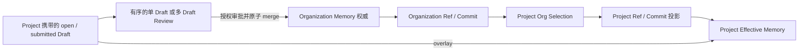

# 统一 Memory 数据模型

本文是 Clumsies 当前 Memory 数据架构的权威说明，面向实现、接口和质量评审。它描述系统现在如何确定发布权威、Project 投影、Draft overlay 与 Review 合并语义；历史迁移过程不在本文展开，参见 [Project Memory 权威切换](/zh/project-authority-migration)。

## 核心结论

当前模型只有一个可发布内容对象：`Memory`。

- **Organization 是唯一的 Memory 发布权威。** 新建、更新、重命名和删除最终都必须通过 Organization-scoped Draft、Review 与 merge 写入 Organization Ref。
- **Project 不是 Memory 权威。** Project 保存 Organization Memory 的选择集合，并持有由该集合生成的 Project Ref；该 Ref 是可同步、可安装的投影，不是第二份发布源。
- **Draft 由 Project 携带。** Draft 的发布目标是 Organization，但在 merge 前只覆盖携带它的 Project 的 Effective Memory，不会直接修改 Organization，也不会影响其他 Project。
- **Review 可以包含一个或多个 Draft。** 多 Draft Review 按顺序关联 Draft，并以一个数据库事务完成校验、应用、Commit 与 Ref 前移；任一 Draft 失败时整次 merge 不提交。
- Rule、Workflow、Context 不再是 Server、daemon 或 MCP 的内容类型。它们只可以作为 Markdown 内容与路径表达的语义；macOS 仍保留的 `MemoryKind` 属于尚未收口的 UI 实现，见[当前实现缺口](#当前实现缺口)。



## 设计理由与当前边界

统一 Memory 不是把旧枚举替换成任意 `type: string`，也不是让检索相关性代替治理：

- 旧 Rule、Workflow、Context 只声明分类，没有验证“指令、事实、流程”的内容语义；让这三个值继续支配 API、身份、路径、UI 和 Adapter 行为，只会把一次分类调整放大成全链路协议变更。
- `activate` 不接收 kind filter。Project selection 决定哪些发布资源进入 Effective Memory，之后所有 Memory 使用同一套分块、BM25、向量召回、RRF、重排和预算流程；排序算法不靠旧三分类分派。
- 任意字符串类型仍会把用户 taxonomy 与系统行为绑在一起。当前 wire contract 因此只接受统一的 `memory`，不会根据路径、标题或用户命名生成新系统类型。
- 检索只判断相关性，不授予内容权威。Organization publication、Project selection、Commit 来源和 Draft 状态共同决定来源与治理边界；未发布 overlay 不能被误报为 Organization 权威。
- 当前模型没有 Category/Tag、`content_type`、`agent_instruction` 或 `invocable_skill` 字段。未来如要增加用户 taxonomy、内容格式或可执行能力，必须作为彼此正交且可授权的契约设计，不能从分类显示名或 `workflow/` 路径隐式推导。

## 对象与权威边界

### Memory

Server 中的发布资源以 `resources` 记录，当前业务语义如下：

| 字段 | 当前语义 |
|---|---|
| `memory_id` / `resource_id` | 稳定的不透明标识。新资源使用 `mem_` 前缀；迁移前的 `ctx_`、`rul_`、`wfl_` 标识继续有效，不因统一模型或重命名而改写。 |
| `scope` | 活跃发布资源只能是 `org`。`project` 仍存在于部分 schema 和读取接口中，仅用于历史数据兼容与清理。 |
| `path` | Organization 命名空间内的资源路径；活跃资源路径唯一。重命名改变路径，不改变资源标识。 |
| `name` | Server 权威元数据，由路径最后一段生成；它不是独立编辑的展示标题。 |
| `description` | 资源的语义摘要。数据库字段非空，但当前链路允许空字符串，并存在 merge 未持久化 Draft description 的缺口。 |
| `body` / `content` | Markdown 正文。HTTP 详情使用 `content`，数据库保存为 `body`。 |
| `content_hash` | 完整正文的内容哈希，用于加载缓存、Draft 更新和一致性校验。 |
| `revision` | Server 资源修订号；与 Draft version、Review version、selection revision 不是同一个并发令牌。 |
| `status` | `active`、`deprecated` 或 `archived`。历史 Project authority 数据在切换后应为非活跃状态。 |

统一模型没有公开的 Rule、Workflow、Context 子类型，也没有 `content_format` 字段。当前正文按 Markdown 处理。

### `name`、内容标题与 Draft 标题

这三个概念不能互换：

| 概念 | 来源 | 用途 |
|---|---|---|
| Memory `name` | Server 根据 `path` 最后一段生成，例如 `architecture.md` | 权威资源元数据与列表显示的基础值 |
| 内容标题 `title` | daemon 取 Markdown 第一个标题；没有标题时取路径文件名并去掉扩展名 | Effective Memory 检索结果和本地展示 |
| Draft `title` | 创建 Draft 时提供的提案标题 | Review 与变更说明，不属于合并后的 Memory 内容模型 |

因此，修改 Markdown 一级标题不会改变 Server 的 `name`；重命名路径会改变 `name`，但不必改变正文标题；Draft 标题也不会成为 Memory 标题。

### Tree、Commit 与 Ref

发布状态通过不可变 Commit 与可前移 Ref 分发：

- Organization Ref 指向 Organization 当前发布 Commit。
- Project Org Selection 保存 Project 选择的 Organization `resource_ids`，并有独立的 `revision` 用于并发控制。
- Project Commit 将被选中的 Organization Memory 写成 `source = selected_org` 的 Tree entry，并附带一个 `project_org_selection` 系统 entry。
- Project Ref 指向最新投影 Commit。所选 Organization Memory 发生变化时，Server 刷新受影响 Project 的投影。
- daemon 安装 Project Commit 后，再叠加该 Project 本地 `open`、`submitted` Draft，得到 Effective Memory。

运行时 Tree entry 的内容类型只有：

| `type` | 含义 |
|---|---|
| `memory` | 可进入 Effective Memory 的 Markdown 资源 |
| `project_org_selection` | daemon 使用的 Project 选择快照；不是用户 Memory |

Memory Tree entry 还携带 `description`，使 daemon 能把摘要作为独立检索字段。公共 OpenAPI 对这部分的声明目前落后于运行时，见[当前实现缺口](#当前实现缺口)。

daemon 的历史缓存读取器仍接受 `context`、`rule`、`workflow` Tree entry，并统一投影为 Memory；新同步与新写入不能再产生这些值。这是不可变 Commit 与旧缓存的只读兼容边界，不是对旧 wire type 的恢复。用户分类名称的变化也不能改写资源 ID 或赋予执行能力。

## Project 投影与 Effective Memory

Project 的当前读取语义是投影加 overlay：

```text
Project Effective Memory
  = Project Ref 中已选择的 Organization Memory
  + 该 Project 携带的 open / submitted Draft overlay
```

Draft overlay 按操作语义覆盖基线：

- Create 增加仅在当前 Project 可见的候选 Memory；
- Update 替换目标 Memory 的候选正文；
- Rename 改变候选路径；
- Delete 从当前 Project 的 Effective Memory 中隐藏目标；
- Discard 取消 Draft，不形成发布变更。

overlay 只是提交前视图。`memory.store` 成功表示本地 Draft 已持久化并进入同步队列，不表示 Organization 已发布，也不表示 Organization Ref 已移动。

## Draft、Review 与原子发布

### Draft

当前可写 Draft 必须满足：

- `project_id` 表示携带 Draft 的 Project；
- `resource.scope = org` 表示 merge 后的权威目标；
- `base_commit_id` 与 Draft version 分别用于上游协调和并发控制；
- 一个 Draft 保存有序操作，状态为 `open`、`submitted`、`merged` 或 `discarded`；
- 对已有 Organization Memory 的变更必须以该 Project 已选择的资源为目标；Create 在 merge 后会自动加入携带 Project 的选择集合。

### 多 Draft Review

Review 使用有序、去重的 `drafts[]`：每项包含 `draft_id` 与 `expected_draft_version`。一个 Review 至少包含一个 Draft。

多 Draft Review 的关键约束是：

1. 所有 Draft 必须属于同一个 Project、使用同一权威 scope，并处于可提交状态。
2. 多 Draft 提交前必须逐个完成 reconciliation；单 Draft 接口中的临时候选解析不能代替整组协调。
3. 创建或重新提交 Review 时校验每个 `expected_draft_version`；merge 再锁定 Review 和所有 Draft，检查 Review version、Draft 状态、Base Commit、审批结果哈希与当前 Organization Ref。
4. 所有 Draft 的操作按 Review 中的顺序物化并在同一事务中应用。
5. 事务只生成一个新的 Organization Commit，并前移一次 Organization Ref；随后刷新受影响的 Project 投影。
6. 任一校验、操作或 Commit 失败时事务回滚，不会发布半组 Draft。

Review 的批准只对当时的完整结果哈希有效。Draft 内容变化或 rebase 后必须重新形成有效审批，不能沿用旧批准。

## HTTP 读取边界

以下接口读取当前 Organization 权威或 Project 投影配置：

| 接口 | 语义 |
|---|---|
| `GET /api/v1/org/memories` | Organization 发布 Memory 列表 |
| `GET /api/v1/org/memories/{memory_id}` | Organization 发布 Memory 详情 |
| `GET/PUT /api/v1/projects/{project_id}/org-selections` | Project 的 Organization Memory 选择集合；更新使用 selection revision 做前置条件 |
| `GET /api/v1/projects/{project_id}/commit-state` | Project 投影 Ref 与可下载 Commit 状态 |
| `GET /api/v1/commits/{commit_id}` | Commit、Tree、Blob 与 Project 选择快照 |

### Legacy Project Memory endpoints

`GET /api/v1/projects/{project_id}/memories` 与 `GET /api/v1/projects/{project_id}/memories/{memory_id}` 仍按 `scope = project` 查询历史 Project-authority 资源。它们：

- **不是** Project Effective Memory 接口；
- 不返回 Project 已选择的 Organization Memory；
- 不叠加本地 Draft；
- 在完成权威切换的正常 Project 中通常为空。

新客户端不应使用这两个端点构建 Project Memory 视图。应使用 Project Org Selection、Project Commit payload，以及 daemon 提供的 Effective Memory 能力。

## 当前实现缺口

以下事项尚未闭环，不能写成已完成能力：

1. **公共 OpenAPI 的 `TreeEntry` 契约过时。** Rust 与数据库只接受 `memory | project_org_selection`，且运行时 `TreeEntry` 可携带 `description`；当前 OpenAPI 和生成的 TypeScript 仍声明 `rule | context | workflow | project_org_selection`，同时遗漏 `description`。在契约修复前，运行时 Rust/数据库行为才是事实，但外部客户端仍有类型不一致风险。
2. **`description` 尚未可靠持久化。** MCP、macOS 与 Draft API 当前都允许省略 description；Server merge 的资源 Create/Update 路径也尚未把 Draft content 中的 description 写入 `resources.description`。因此已合并资源可能保留空摘要，不能宣称 description-aware retrieval 已端到端保证。
3. **macOS 的 `MemoryKind` 尚未移除。** UI 仍以 `context`、`rules`、`workflows` 做创建默认值、路径校验、预览选择与 Bundle 分组。这是 UI 层遗留行为，不代表 Server、daemon 或 MCP 恢复了三种 wire type。
4. **用户 taxonomy 与系统 capability 尚未建模。** 当前没有 Category/Tag、独立内容格式、指令信任级别或可执行 capability。活动 Adapter 只安装通用 Clumsies bootstrap，并通过 MCP 动态读取普通 Memory；它不会再把 `workflow/` 路径自动发布成 host skill。若产品需要这些能力，必须先定义权限、版本、归档和兼容语义，不能把自由字符串重新塞回 `type`。

修复这些缺口时，应同步更新 OpenAPI、生成客户端、Server merge、macOS UI 与对应契约测试；仅修改本文不能视为实现完成。

## 不变量

- Organization 是唯一可发布 Memory authority；Project-scoped active resource 或 open/submitted Draft 均不合法。
- Project 的选择集合、Project Ref 投影和本地 Draft overlay 是三个不同层次，revision 不能混用。
- 资源 ID 在重命名、统一模型和投影过程中保持稳定。
- 一个 Review 的所有 Draft 要么在一个事务中全部发布，要么一个也不发布。
- Effective Memory 可以包含未发布 overlay；任何读取结果都必须保留其 source、Draft 或 Commit 来源，不能把候选状态误报为 Organization 权威。
- MCP 与 daemon 不能审批、merge 或直接发布 Organization Memory；授权发布只能经过 Server Review 流程。
